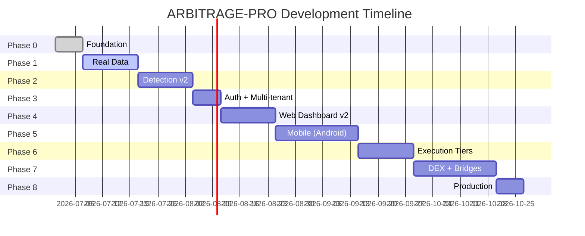

# Phased Roadmap

**Document:** Phase 0 — Foundation
**Cross-References:** [01_PROJECT_VISION.md](01_PROJECT_VISION.md), [26_PROJECT_ROADMAP.md](26_PROJECT_ROADMAP.md)

---

## 1. Overview

ARBITRAGE-PRO is built in 8 phases over 20 weeks. Each phase produces working, tested, mergeable code with explicit acceptance criteria.

**Total Duration:** 20 weeks (approximately 5 months)
**Team:** AI agents + human engineers
**Methodology:** TDD with agent-assisted development

---

## 2. Phase Summary



---

## 3. Phase Details

### Phase 0 — Foundation (Week 1)

**Goal:** Repository prep, CI gates, testing framework, workspace boundaries

**Tasks:**
- Task 0.1: Lock scope & create `.hermes/plans/INDEX.md`
- Task 0.2: Add Tailwind to web app
- Task 0.3: ESLint workspace boundary rules
- Task 0.4: Replace stub test scripts with vitest
- Task 0.5: Real CI jobs (lint + test + build)
- Task 0.6: Tighten `.gitignore`
- Task 0.7: Fix Windows Supabase CLI binary
- Task 0.8: Scaffold `packages/persistence` + `packages/cache`

**Acceptance Criteria:**
- [ ] `pnpm -r build` passes
- [ ] `pnpm -r test` passes (98+ tests)
- [ ] GitHub Actions shows green on all 3 jobs
- [ ] ESLint boundaries enforced
- [ ] `.gitignore` clean after build

**Deliverables:**
- CI pipeline (lint → test → build)
- Workspace boundary rules
- vitest configured across all packages
- Scaffolded persistence + cache packages

---

### Phase 1 — Real Data (Weeks 2-3)

**Goal:** Live CEX connectors, Supabase persistence, detector cron

**Tasks:**
- Task 1.1: `Connector` interface in `packages/shared`
- Task 1.2: Env-driven connector registry
- Task 1.3: Real Binance REST connector (TDD)
- Task 1.4: Real OKX REST connector (TDD)
- Task 1.5: Real Kraken REST connector (TDD)
- Task 1.6: Replace mock with fan-out across enabled connectors
- Task 1.6b: Auto-pair-discovery for 60 venues
- Task 1.7: Schema: `connector_id` link
- Task 1.8: `SupabasePersistence.upsertOpportunities`
- Task 1.9: Schema: `dex_pools` table
- Task 1.10: 5s detector cron in `apps/api`
- Task 1.11: Add Supabase Auth client to web app

**Acceptance Criteria:**
- [ ] 5 CEX connectors live (Binance, OKX, Kraken, Coinbase, Bybit)
- [ ] Real-time snapshots flowing to Supabase
- [ ] 5s detector cron running
- [ ] Auto-discovery of 70 trading pairs
- [ ] WebSocket price updates working

**Deliverables:**
- 5 production CEX connectors
- Supabase persistence layer
- 5s detector worker
- Pair discovery system

---

### Phase 2 — Detection v2 (Weeks 4-5)

**Goal:** Triangular + cross-chain engines, risk scoring, detector orchestration

**Tasks:**
- Task 2.1: Triangular engine (`packages/engine/src/triangular.ts`)
- Task 2.2: Cross-chain engine (`packages/engine/src/cross-chain.ts`)
- Task 2.3: Risk + profitability scorer (`packages/risk/`)
- Task 2.4: Detector orchestration service
- Task 2.5: Stale-snapshot filtering at engine layer

**Acceptance Criteria:**
- [ ] Triangular detector finds 3-cycles with profit >1%
- [ ] Cross-chain detector works with mock bridge quotes
- [ ] Risk score calculated for all opportunities
- [ ] Detector returns combined sorted results
- [ ] Stale snapshots (>5s) rejected

**Deliverables:**
- Triangular arbitrage engine
- Cross-chain arbitrage engine
- 5-factor risk scorer
- Orchestrated detector service

---

### Phase 3 — Auth + Multi-Tenant (Week 6)

**Goal:** Supabase Auth, RLS policies, per-user data isolation

**Tasks:**
- Task 3.1: Supabase Auth wiring on web
- Task 3.2: Per-user `alert_rules` and `opportunity_watchlist`
- Task 3.3: Add app-layer RLS test

**Acceptance Criteria:**
- [ ] Email + OAuth login works
- [ ] Cookie-based session persistence
- [ ] RLS policies enforce user isolation
- [ ] Each user sees only their data
- [ ] Auth-aware dashboard

**Deliverables:**
- Supabase Auth integration
- Login/callback routes
- RLS smoke tests
- User profiles table

---

### Phase 4 — Web Dashboard v2 (Weeks 7-8)

**Goal:** Authed dashboard, realtime opportunities, alert rules UI

**Tasks:**
- Task 4.1: TanStack Query on web
- Task 4.2: Supabase Realtime subscription
- Task 4.3: Opportunity detail page
- Task 4.4: Alert rules CRUD UI
- Task 4.5: Watchlist screen
- Task 4.6: Settings page

**Acceptance Criteria:**
- [ ] Dashboard shows live opportunities
- [ ] Realtime updates without refresh
- [ ] Alert rules CRUD functional
- [ ] Watchlist shows saved opportunities
- [ ] Settings page loads user preferences

**Deliverables:**
- TanStack Query integration
- Realtime subscriptions
- Opportunity detail view
- Alert rules manager
- User settings

---

### Phase 5 — Mobile App, Android-First (Weeks 9-13)

**Goal:** Expo React Native app with push notifications, biometric auth, split-screen

**Tasks:**
- Task 5.1: Scaffold Expo app with Android flags
- Task 5.2: Share types with web/app
- Task 5.3: Auth screen
- Task 5.4: Tile-based home screen (split-screen optimized)
- Task 5.5: Opportunities list + detail
- Task 5.6: Push notification reliability
- Task 5.7: Class-3 biometric gate
- Task 5.8: Multi-window / split-screen polish
- Task 5.9: Bundle size + low-RAM budget
- Task 5.10: Offline-first cache
- Task 5.11: EAS Build config
- Task 5.12: Play Store metadata + screenshots
- Task 5.13: iOS parity

**Acceptance Criteria:**
- [ ] App launches in <2s
- [ ] Push notifications arrive <5s
- [ ] Biometric auth works (Class-3)
- [ ] Split-screen works at 30% width
- [ ] Memory usage <150MB
- [ ] Offline cache shows last-known data
- [ ] Play Store listing live
- [ ] App Store approval (iOS)

**Deliverables:**
- Expo React Native app
- Push notification system
- Biometric authentication
- Split-screen UI
- Play Store + App Store apps

---

### Phase 6 — Execution Tiers (Weeks 12-14)

**Goal:** 3-tier execution (manual → simulated → automated) with guardrails

**Tasks:**
- Task 6.1: Create `packages/execution` with 3-tier router
- Task 6.2: Manual executor (in-app "Execute now")
- Task 6.3: Simulated (paper-trade) mode
- Task 6.4: Automated — guardrails
- Task 6.5: Add `automation_settings` to schema
- Task 6.6: Job queue for auto-execution
- Task 6.7: Audit log + per-trade write
- Task 6.8: Mobile execute button
- Task 6.9: Alert evaluator

**Acceptance Criteria:**
- [ ] Manual execution works (env-gated)
- [ ] Simulated mode generates paper trades
- [ ] All 6 guardrails enforced
- [ ] Audit log records all attempts
- [ ] Alert evaluator sends pushes
- [ ] Mobile execute button with biometric

**Deliverables:**
- 3-tier executor
- Guardrail system
- BullMQ job queues
- Alert evaluator
- Audit trail

---

### Phase 7 — DEX + Bridges (Weeks 15-17)

**Goal:** DEX connectors and cross-chain bridge aggregation

**Tasks:**
- Task 7.1: Uniswap V3 connector (sqrtPrice math)
- Task 7.2: PancakeSwap + Sushi connectors
- Task 7.3: 1inch aggregator quote
- Task 7.4: Stargate bridge fee API
- Task 7.5: Wormhole bridge quote
- Task 7.6: Cross-chain engine honors real bridges
- Task 7.7: Connector registry UI

**Acceptance Criteria:**
- [ ] Uniswap V3 prices correct (sqrtPriceX96)
- [ ] 1inch aggregator works
- [ ] Stargate bridge quotes live
- [ ] Wormhole quotes live
- [ ] Cross-chain detector uses real bridges
- [ ] UI toggle for connectors

**Deliverables:**
- 6 DEX connectors
- 4 bridge connectors
- Cross-chain engine integration
- Connector management UI

---

### Phase 8 — Production Hardening (Week 20)

**Goal:** SLOs, monitoring, security review, App Store launch

**Tasks:**
- Task 8.1: OpenAPI / Swagger at `/api/docs`
- Task 8.2: Sentry on web + api + mobile
- Task 8.3: PostHog on web + mobile
- Task 8.4: `@nestjs/throttler` on API
- Task 8.5: API auth via Supabase JWT
- Task 8.6: Backup + restore for Supabase
- Task 8.7: Security review (OWASP top 10)
- Task 8.8: ASO assets (screenshots + promo video)
- Task 8.9: App Store + Play Store submission
- Task 8.10: Launch monitoring dashboard

**Acceptance Criteria:**
- [ ] All endpoints documented in Swagger
- [ ] Error tracking operational
- [ ] Analytics events firing
- [ ] Rate limiting enforced
- [ ] Backup/restore tested
- [ ] Security review signed off
- [ ] Play Store app live
- [ ] App Store app live
- [ ] Grafana dashboard showing SLOs

**Deliverables:**
- OpenAPI documentation
- Error tracking (Sentry)
- Analytics (PostHog)
- Rate limiting
- Security audit report
- Production deployments

---

## 4. Critical Path

```
Phase 0 → Phase 1 → Phase 2 → Phase 3 → Phase 4 → Phase 5 (parallel with 6)
                                               → Phase 6 → Phase 7 → Phase 8
```

**Parallel tracks:**
- Phase 5 (Mobile) and Phase 6 (Execution) overlap by 2 weeks
- Phase 7 can start once Phase 2 cross-chain engine is complete

**Blocking dependencies:**
- Phase 3 (Auth) blocks Phase 4 (Web dashboard)
- Phase 1 (Connectors) blocks Phase 2 (Detection)
- Phase 2 (Detection) blocks Phase 6 (Execution)

---

## 5. Risk Mitigation by Phase

| Phase | Risk | Mitigation |
|---|---|---|
| 0 | CI pipeline breaks | Test on clean environment first |
| 1 | Exchange API rate limits | Per-connector rate limiter in Redis |
| 2 | False positives too high | Staleness checks, liquidity validation |
| 3 | Auth complexity | Use Supabase Auth (batteries included) |
| 4 | Realtime overhead | Debounce updates, pagination |
| 5 | Push notification reliability | Foreground service, battery whitelist tutorial |
| 6 | Auto-execute losses | 6 hard guardrails, kill switch |
| 7 | DEX math errors | Extensive sqrtPrice fixtures |
| 8 | App Store rejection | Detect+display only initially |

---

## 6. Success Metrics

### Phase 0
- CI pipeline green: 100%
- Test coverage: >80%

### Phase 1
- 5 CEX connectors live
- 5s detector cycle time
- 99% connector uptime

### Phase 2
- Triangular opportunities detected
- Cross-chain opportunities detected
- Risk score accuracy: >90%

### Phase 3
- Auth flow completion: 100%
- RLS policy coverage: 100%

### Phase 4
- Dashboard load time: <2s
- Realtime latency: <5s

### Phase 5
- Mobile crash rate: <0.1%
- Push delivery: <5s (p99)
- Biometric success: >95%

### Phase 6
- Manual execution success: >99%
- Zero unauthorized auto-trades
- Guardrail enforcement: 100%

### Phase 7
- DEX price accuracy: >99%
- Bridge quote latency: <10s

### Phase 8
- App Store rating: ≥4.0
- DAU: 1000+
- Uptime: 99.9%

---

## 7. Resource Allocation

| Phase | AI Agents | Human Engineers | Focus |
|---|---|---|---|
| 0 | @architect, @backend | 1 | Setup |
| 1 | @backend, @database | 1 | Connectors |
| 2 | @backend, @trading-analyst | 1 | Detection |
| 3 | @backend, @security | 1 | Auth |
| 4 | @frontend | 1 | Dashboard |
| 5 | @mobile | 1 | Mobile app |
| 6 | @backend, @security | 1-2 | Execution |
| 7 | @backend | 1-2 | DEX + bridges |
| 8 | @launch-ops, @security | 2 | Launch |

---

## 8. Acceptance Criteria

- [ ] All 8 phases completed
- [ ] All acceptance criteria met per phase
- [ ] CI/CD pipeline green
- [ ] Test coverage >80%
- [ ] Security review passed
- [ ] Mobile apps published
- [ ] Documentation complete
- [ ] 1000 DAU milestone reached

## Engineering Notes

- Each phase produces mergeable, tested code
- No phase starts until previous phase acceptance criteria met
- Mobile and execution phases overlap by 2 weeks
- Security review is mandatory before Phase 8
- Real-money testing only after guardrails proven