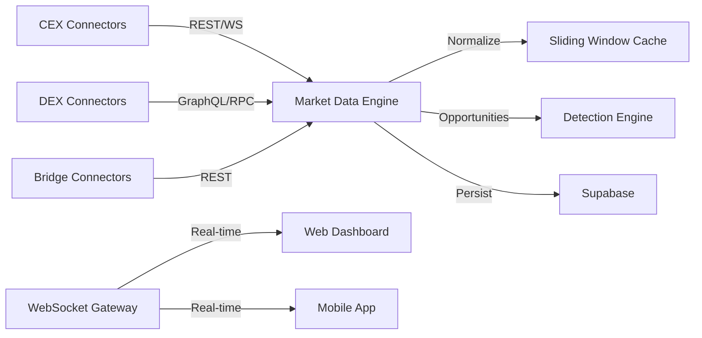
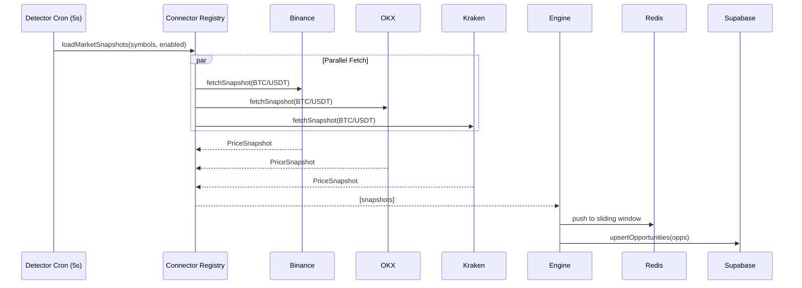

**See also:** [07_CONNECTOR_SPECIFICATION.md](07_CONNECTOR_SPECIFICATION.md), [12_ASSET_NORMALIZATION.md](12_ASSET_NORMALIZATION.md), [09_DISCOVERY_ENGINE.md](09_DISCOVERY_ENGINE.md)
# Market Data Engine

**Document:** Phase 1 — Real Data
**Cross-References:** [07_CONNECTOR_SPECIFICATION.md](07_CONNECTOR_SPECIFICATION.md), [09_DISCOVERY_ENGINE.md](09_DISCOVERY_ENGINE.md)

---

## 1. Overview

The Market Data Engine ingests real-time price data from CEX, DEX, and bridge connectors, normalizes it, and distributes it to the Detection Engine and cache layer.

**Key Properties:**
- Fan-out pattern — one symbol to many connectors
- Fault-tolerant — partial failures don't block the cycle
- Time-series sliding window — 5-second windows for real-time analysis
- Backpressure handling — Redis queue prevents memory overflow

---

## 2. Architecture



---

## 3. Data Flow

### 3.1 Ingestion Pipeline



### 3.2 Data Model

```typescript
// packages/shared/src/market.ts
export interface MarketSnapshot {
  readonly timestamp: number;           // Unix ms
  readonly symbols: TradingPair[];
  readonly snapshots: PriceSnapshot[];
  readonly source: 'rest' | 'websocket' | 'rpc';
}

export interface SlidingWindow {
  readonly key: string;                 // 'BTC/USDT'
  readonly windowSize: number;          // seconds
  readonly snapshots: PriceSnapshot[];
  readonly stats: WindowStats;
}

export interface WindowStats {
  readonly count: number;
  readonly avgBid: number;
  readonly avgAsk: number;
  readonly minBid: number;
  readonly maxAsk: number;
  readonly volatility: number;
}
```

---

## 4. Connector Fan-Out

### 4.1 Load Market Snapshots

```typescript
// packages/connectors/src/index.ts
export class ConnectorRegistry {
  async loadMarketSnapshots(
    symbols: TradingPair[],
    enabledConnectorIds: string[]
  ): Promise<PriceSnapshot[]> {
    const connectors = enabledConnectorIds
      .map(id => this.connectors.get(id))
      .filter((c): c is Connector => 
        c !== undefined && c.status === 'active'
      );
    
    // Fan out: each symbol to all connectors
    const results = await Promise.allSettled(
      symbols.map(symbol =>
        Promise.allSettled(
          connectors.map(connector => 
            this.withTimeout(
              connector.fetchSnapshot(symbol),
              5000 // 5s timeout
            )
          )
        )
      )
    );
    
    // Flatten and filter successes
    return results.flatMap(symbolResult =>
      symbolResult.status === 'fulfilled'
        ? symbolResult.value
            .filter((r): r is PriceSnapshot => r.status === 'fulfilled')
            .map(r => r.value)
        : []
    );
  }
  
  private async withTimeout<T>(
    promise: Promise<T>,
    ms: number
  ): Promise<T | null> {
    return Promise.race([
      promise.then(result => result as T),
      new Promise<T | null>(resolve => 
        setTimeout(() => {
          logger.warn('Timeout exceeded');
          resolve(null);
        }, ms)
      )
    ]);
  }
}
```

### 4.2 Rate Limiting

```typescript
// packages/connectors/src/rate-limiter.ts
export class RateLimiter {
  private buckets: Map<string, TokenBucket> = new Map();
  
  async acquire(connectorId: string, limit: number, windowMs: number): Promise<void> {
    const bucket = this.buckets.get(connectorId) ?? 
      new TokenBucket(limit, windowMs);
    
    if (!this.buckets.has(connectorId)) {
      this.buckets.set(connectorId, bucket);
    }
    
    await bucket.acquire();
  }
}
```

**Per-Exchange Limits:**

| Exchange | Limit | Window | Implementation |
|---|---|---|---|
| Binance | 1200 requests | 1 minute | Token bucket |
| OKX | 600 requests | 1 minute | Token bucket |
| Kraken | 300 requests | 1 minute | Token bucket |
| Coinbase | 600 requests | 1 minute | Token bucket |
| Bybit | 120 requests | 1 minute | Token bucket |

---

## 5. Sliding Window Cache

### 5.1 Redis Sliding Window

```typescript
// packages/cache/src/sliding-window.ts
export class SlidingWindowCache {
  constructor(private redis: Redis) {}
  
  async addSnapshot(key: string, snapshot: PriceSnapshot): Promise<void> {
    const windowKey = `window:${key}`;
    const now = Date.now();
    const windowStart = now - (5 * 1000); // 5s window
    
    // Add snapshot to sorted set
    await this.redis.zAdd(windowKey, {
      score: now,
      value: JSON.stringify(snapshot)
    });
    
    // Remove old snapshots
    await this.redis.zRemRangeByScore(windowKey, 0, windowStart);
    
    // Set TTL on key
    await this.redis.expire(windowKey, 10);
  }
  
  async getWindow(key: string, windowSeconds: number): Promise<PriceSnapshot[]> {
    const windowKey = `window:${key}`;
    const now = Date.now();
    const windowStart = now - (windowSeconds * 1000);
    
    const raw = await this.redis.zRangeByScore(
      windowKey,
      windowStart,
      now
    );
    
    return raw.map(r => JSON.parse(r.value) as PriceSnapshot);
  }
  
  async getStats(key: string, windowSeconds: number): Promise<WindowStats> {
    const snapshots = await this.getWindow(key, windowSeconds);
    
    if (snapshots.length === 0) {
      return {
        count: 0,
        avgBid: 0,
        avgAsk: 0,
        minBid: 0,
        maxAsk: 0,
        volatility: 0
      };
    }
    
    const bids = snapshots.map(s => s.bid);
    const asks = snapshots.map(s => s.ask);
    
    return {
      count: snapshots.length,
      avgBid: average(bids),
      avgAsk: average(asks),
      minBid: Math.min(...bids),
      maxAsk: Math.max(...asks),
      volatility: standardDeviation(bids)
    };
  }
}
```

### 5.2 Cache Keys

| Key Pattern | TTL | Purpose |
|---|---|---|
| `window:{symbol}` | 10s | 5-second sliding window of snapshots |
| `stats:{symbol}` | 60s | Aggregated stats for opportunity detection |
| `opp:{user_id}` | 30s | User's opportunity cache |
| `health:{connector_id}` | 300s | Connector health status |
| `discovery:{connector_id}` | 86400s | Discovered pairs (24h) |

---

## 6. WebSocket Real-Time Updates

### 6.1 WebSocket Gateway

```typescript
// apps/api/src/websocket/gateway.ts
@WebSocketGateway({
  cors: { origin: '*' },
  transports: ['websocket']
})
export class MarketsGateway implements OnGatewayConnection {
  @WebSocketServer()
  server: Server;
  
  private opportunitySubscribers: Map<string, Set<WebSocket>> = new Map();
  
  handleConnection(client: WebSocket) {
    logger.info('Client connected', { id: client.id });
  }
  
  @SubscribeMessage('subscribe:opportunities')
  handleSubscribeOpportunities(
    @ConnectedSocket() client: WebSocket,
    @MessageBody() userId: string
  ) {
    const subscribers = this.opportunitySubscribers.get(userId) ?? new Set();
    subscribers.add(client);
    this.opportunitySubscribers.set(userId, subscribers);
    
    client.emit('subscribed', { userId });
  }
  
  broadcastOpportunity(opportunity: ArbitrageOpportunity) {
    const subscribers = this.opportunitySubscribers.get(opportunity.userId);
    if (!subscribers) return;
    
    subscribers.forEach(client => {
      client.emit('opportunity', {
        id: opportunity.id,
        pair: opportunity.pair,
        netProfitBps: opportunity.estimatedNetProfitBps,
        riskScore: opportunity.riskScore,
        detectedAt: opportunity.detectedAt
      });
    });
  }
}
```

### 6.2 Client Subscription

```typescript
// apps/web/hooks/useRealtimeOpportunities.ts
export function useRealtimeOpportunities(userId: string) {
  const [opportunities, setOpportunities] = useState<ArbitrageOpportunity[]>([]);
  const { data: queryData } = useQuery({
    queryKey: ['opportunities', userId],
    queryFn: () => api.getOpportunities(userId)
  });
  
  useEffect(() => {
    const ws = new WebSocket(WS_URL);
    
    ws.onopen = () => {
      ws.send(JSON.stringify({
        type: 'subscribe:opportunities',
        userId
      }));
    };
    
    ws.onmessage = (event) => {
      const message = JSON.parse(event.data);
      
      if (message.type === 'opportunity') {
        setOpportunities(prev => [message.data, ...prev]);
      }
    };
    
    return () => ws.close();
  }, [userId]);
  
  return opportunities;
}
```

---

## 7. Data Aggregation

### 7.1 Window Statistics

```typescript
// packages/engine/src/filter.ts
export function computeWindowStats(snapshots: PriceSnapshot[]): WindowStats {
  if (snapshots.length === 0) {
    return {
      count: 0,
      avgBid: 0,
      avgAsk: 0,
      minBid: 0,
      maxAsk: 0,
      volatility: 0
    };
  }
  
  const bids = snapshots.map(s => s.bid);
  const asks = snapshots.map(s => s.ask);
  
  return {
    count: snapshots.length,
    avgBid: mean(bids),
    avgAsk: mean(asks),
    minBid: Math.min(...bids),
    maxAsk: Math.max(...asks),
    volatility: standardDeviation(bids)
  };
}

export function isStale(snapshot: PriceSnapshot, maxAgeSeconds: number): boolean {
  const ageMs = Date.now() - snapshot.timestamp;
  return ageMs > (maxAgeSeconds * 1000);
}

export function filterFresh(
  snapshots: PriceSnapshot[],
  maxAgeSeconds: number = 5
): PriceSnapshot[] {
  return snapshots.filter(s => !isStale(s, maxAgeSeconds));
}
```

### 7.2 Symbol Aggregation

```typescript
// packages/engine/src/aggregate.ts
export function aggregateSnapshots(
  snapshots: PriceSnapshot[]
): Map<string, AggregatedSnapshot> {
  const grouped = new Map<string, PriceSnapshot[]>();
  
  // Group by symbol
  for (const snapshot of snapshots) {
    const key = snapshot.symbol.symbol;
    const existing = grouped.get(key) ?? [];
    existing.push(snapshot);
    grouped.set(key, existing);
  }
  
  // Aggregate each group
  const result = new Map<string, AggregatedSnapshot>();
  for (const [symbol, snaps] of grouped) {
    result.set(symbol, {
      symbol,
      bestBid: Math.max(...snaps.map(s => s.bid)),
      bestAsk: Math.min(...snaps.map(s => s.ask)),
      bestBidQty: snaps.reduce((sum, s) => sum + s.bidQty, 0),
      bestAskQty: snaps.reduce((sum, s) => sum + s.askQty, 0),
      sources: snaps.map(s => s.exchange.code),
      timestamp: Math.max(...snaps.map(s => s.timestamp))
    });
  }
  
  return result;
}
```

---

## 8. Detector Cron

### 8.1 5-Second Detection Cycle

```typescript
// apps/api/src/workers/detector.worker.ts
@Cron('*/5 * * * * *') // Every 5 seconds
export class DetectorWorker {
  constructor(
    private connectorRegistry: ConnectorRegistry,
    private marketService: MarketService,
    private persistence: SupabasePersistence
  ) {}
  
  async handle() {
    try {
      // 1. Fetch enabled connectors
      const enabledConnectors = await this.getEnabledConnectors();
      
      // 2. Fetch all discovered pairs
      const symbols = await this.getAllDiscoveredPairs();
      
      // 3. Fan out to connectors
      const snapshots = await this.connectorRegistry.loadMarketSnapshots(
        symbols,
        enabledConnectors
      );
      
      // 4. Update sliding window
      await this.updateSlidingWindow(snapshots);
      
      // 5. Detect opportunities
      const opportunities = await this.marketService.getOpportunities(snapshots);
      
      // 6. Persist top 50
      if (opportunities.length > 0) {
        await this.persistence.upsertOpportunities(opportunities.slice(0, 50));
      }
      
      // 7. Broadcast via WebSocket
      opportunities.forEach(opp => {
        this.wsGateway.broadcastOpportunity(opp);
      });
      
    } catch (error) {
      logger.error({ error }, 'Detector cycle failed');
    }
  }
}
```

### 8.2 Performance Targets

| Metric | Target | Timeout |
|---|---|---|
| Full cycle | <5 seconds | 5s |
| Per-connector fetch | <500ms | 5s |
| Aggregation | <100ms | 1s |
| Persistence | <500ms | 5s |
| WebSocket broadcast | <50ms | 100ms |

---

## 9. Error Handling

### 9.1 Partial Failure Tolerance

```typescript
// If 3 out of 5 connectors fail, still process the 2 that succeeded
const results = await Promise.allSettled(
  symbols.map(symbol =>
    Promise.allSettled(
      connectors.map(c => c.fetchSnapshot(symbol))
    )
  )
);

const successful = results.flatMap(r =>
  r.status === 'fulfilled'
    ? r.value.filter((r): r is PriceSnapshot => r.status === 'fulfilled').map(r => r.value)
    : []
);

if (successful.length === 0) {
  logger.error('All connectors failed for this cycle');
  // Alert via Sentry
}
```

### 9.2 Circuit Breaker

```typescript
// packages/connectors/src/circuit-breaker.ts
export class CircuitBreaker {
  private failures: Map<string, number> = new Map();
  private readonly THRESHOLD = 5;
  private readonly RESET_MS = 30000; // 30s
  
  async execute<T>(connectorId: string, fn: () => Promise<T>): Promise<T | null> {
    const failures = this.failures.get(connectorId) ?? 0;
    
    if (failures >= this.THRESHOLD) {
      logger.warn({ connectorId }, 'Circuit breaker open');
      return null;
    }
    
    try {
      const result = await fn();
      this.failures.set(connectorId, 0);
      return result;
    } catch (error) {
      const newFailures = failures + 1;
      this.failures.set(connectorId, newFailures);
      
      if (newFailures >= this.THRESHOLD) {
        logger.error({ connectorId }, 'Circuit breaker tripped');
        // Alert via Sentry
      }
      
      return null;
    }
  }
}
```

---

## 10. Monitoring

### 10.1 Metrics

```typescript
// Prometheus metrics
const detectorCycleDuration = new promClient.Histogram({
  name: 'detector_cycle_duration_seconds',
  help: 'Duration of detector cycle',
  buckets: [0.5, 1, 2, 5, 10]
});

const connectorSnapshotCount = new promClient.Counter({
  name: 'connector_snapshots_total',
  help: 'Total snapshots fetched',
  labelNames: ['connector_id', 'status']
});

const connectorErrors = new promClient.Counter({
  name: 'connector_errors_total',
  help: 'Total connector errors',
  labelNames: ['connector_id', 'error_type']
});
```

### 10.2 Health Checks

```typescript
// GET /health/market-data
{
  "status": "healthy",
  "timestamp": "2026-07-01T12:00:00Z",
  "connectors": {
    "binance": { "status": "active", "latencyMs": 45 },
    "okx": { "status": "active", "latencyMs": 62 },
    "kraken": { "status": "degraded", "latencyMs": -1, "lastError": "Timeout" }
  },
  "lastCycle": {
    "durationMs": 2340,
    "snapshots": 150,
    "opportunities": 12
  }
}
```

---

## 11. Acceptance Criteria

- [ ] 5-second detector cycle running
- [ ] All CEX connectors fanning out in parallel
- [ ] Sliding window cache operational
- [ ] WebSocket broadcasts opportunities in <50ms
- [ ] Partial failures don't block cycle
- [ ] Circuit breaker opens after 5 consecutive failures
- [ ] Health endpoint returns status
- [ ] Metrics exported to Prometheus
- [ ] Error tracking via Sentry

## Engineering Notes

- Use Promise.allSettled for fault-tolerant parallelism
- Timeouts prevent hanging on slow connectors
- Redis sliding window prevents memory bloat
- Circuit breakers prevent cascade failures
- Monitor P99 latency per connector