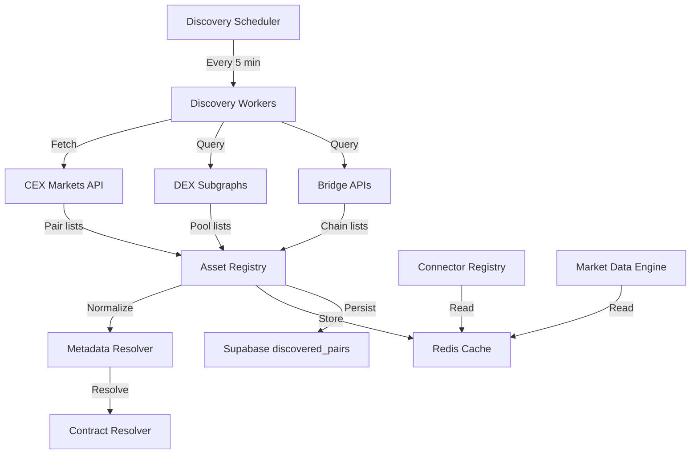
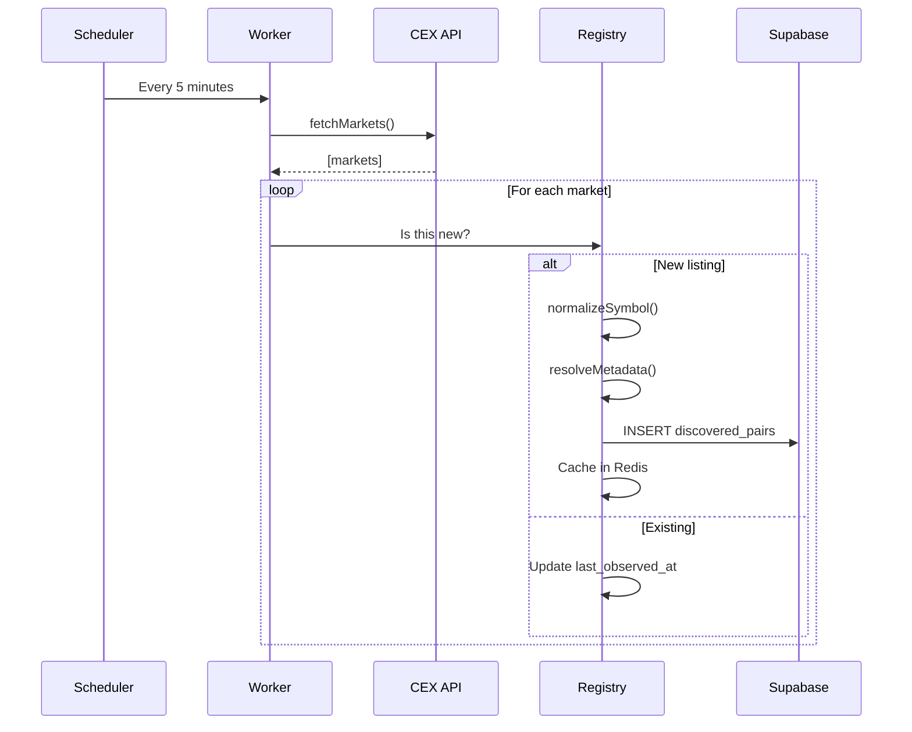

**See also:** [12_ASSET_NORMALIZATION.md](12_ASSET_NORMALIZATION.md), [07_CONNECTOR_SPECIFICATION.md](07_CONNECTOR_SPECIFICATION.md), [08_MARKET_DATA_ENGINE.md](08_MARKET_DATA_ENGINE.md)
# Discovery Engine

**Document:** Phase 1 — Real Data
**Cross-References:** [07_CONNECTOR_SPECIFICATION.md](07_CONNECTOR_SPECIFICATION.md), [08_MARKET_DATA_ENGINE.md](08_MARKET_DATA_ENGINE.md), [12_ASSET_NORMALIZATION.md](12_ASSET_NORMALIZATION.md)

---

## 1. Overview

The Discovery Engine automatically discovers trading pairs, assets, and venues without hardcoded lists. It monitors exchanges for new listings, delistings, and status changes.

**Key Properties:**
- Dynamic — Never hardcoded asset lists
- Incremental — Only fetches changes since last discovery
- Scheduled — Runs every 5 minutes
- Cached — Redis cache with 24h TTL
- Resilient — Handles API failures gracefully

---

## 2. Architecture



---

## 3. Core Components

### 3.1 Discovery Scheduler

```typescript
// packages/connectors/src/discovery/scheduler.ts
export class DiscoveryScheduler {
  constructor(
    private workers: DiscoveryWorker[],
    private cache: DiscoveryCache
  ) {}
  
  @Cron('*/5 * * * *') // Every 5 minutes
  async run() {
    logger.info('Starting discovery cycle');
    
    for (const worker of this.workers) {
      try {
        await this.withTimeout(worker.discover(), 30000);
      } catch (error) {
        logger.error({ worker: worker.id, error }, 'Discovery worker failed');
      }
    }
    
    logger.info('Discovery cycle complete');
  }
  
  private async withTimeout<T>(promise: Promise<T>, ms: number): Promise<T> {
    return Promise.race([
      promise,
      new Promise<T>((_, reject) => 
        setTimeout(() => reject(new Error('Timeout')), ms)
      )
    ]);
  }
}
```

### 3.2 Discovery Workers

```typescript
// packages/connectors/src/discovery/worker.ts
export interface DiscoveryWorker {
  readonly id: string;
  readonly kind: 'cex' | 'dex' | 'bridge';
  discover(): Promise<DiscoveredPair[]>;
}

export class CexDiscoveryWorker implements DiscoveryWorker {
  readonly id = 'cex-discovery';
  readonly kind: 'cex' = 'cex';
  
  constructor(
    private connectorRegistry: ConnectorRegistry,
    private assetRegistry: AssetRegistry
  ) {}
  
  async discover(): Promise<DiscoveredPair[]> {
    const connectors = this.connectorRegistry.getByKind('cex');
    const results: DiscoveredPair[] = [];
    
    for (const connector of connectors) {
      try {
        const pairs = await this.fetchPairs(connector);
        results.push(...pairs);
      } catch (error) {
        logger.warn({ connector: connector.id }, 'Failed to discover pairs');
      }
    }
    
    return results;
  }
  
  private async fetchPairs(connector: Connector): Promise<DiscoveredPair[]> {
    // Use CCXT fetchMarkets
    const markets = await fetchMarketsViaCCXT(connector.id);
    
    return markets
      .filter(m => m.active && m.spot)
      .map(m => ({
        connectorId: connector.id,
        baseAsset: m.base,
        quoteAsset: m.quote,
        symbol: m.symbol,
        chain: undefined,
        contractAddress: undefined,
        status: 'active',
        firstSeenAt: new Date(),
        lastObservedAt: new Date()
      }));
  }
}
```

### 3.3 Asset Registry

```typescript
// packages/connectors/src/discovery/asset-registry.ts
export class AssetRegistry {
  constructor(private cache: DiscoveryCache, private db: SupabasePersistence) {}
  
  async register(pair: DiscoveredPair): Promise<void> {
    // 1. Check if already exists
    const existing = await this.cache.getPair(pair.connectorId, pair.symbol);
    
    if (existing) {
      // Update last observed
      await this.cache.updatePair(pair.connectorId, pair.symbol);
      return;
    }
    
    // 2. Normalize asset
    const normalized = await this.normalizeAsset(pair);
    
    // 3. Resolve metadata
    const metadata = await this.resolveMetadata(normalized);
    
    // 4. Resolve contract address (if DEX)
    const contractAddress = await this.resolveContract(normalized);
    
    // 5. Store in cache
    await this.cache.setPair({
      ...pair,
      normalized,
      metadata,
      contractAddress
    });
    
    // 6. Persist to DB
    await this.db.upsertDiscoveredPair({
      ...pair,
      normalized,
      metadata,
      contractAddress
    });
    
    logger.info({ pair: pair.symbol }, 'Discovered new pair');
  }
  
  private async normalizeAsset(pair: DiscoveredPair): Promise<AssetDescriptor> {
    // Symbol normalization: BTC/XBT/WBTC -> BTC
    const base = normalizeSymbol(pair.baseAsset);
    const quote = normalizeSymbol(pair.quoteAsset);
    
    return {
      assetId: generateAssetId(base, quote, pair.chain),
      identity: resolveAssetIdentity(base, quote),
      baseAsset: base,
      quoteAsset: quote,
      symbol: pair.symbol,
      venueCode: pair.connectorId,
      chain: pair.chain,
      contractAddress: pair.contractAddress,
      decimals: await this.getDecimals(base, pair.chain),
      status: pair.status,
      firstSeenAt: pair.firstSeenAt,
      lastObservedAt: pair.lastObservedAt,
      listingStatus: await this.getListingStatus(base, pair.connectorId)
    };
  }
}
```

### 3.4 Metadata Resolver

```typescript
// packages/connectors/src/discovery/metadata-resolver.ts
export class MetadataResolver {
  async resolve(asset: AssetDescriptor): Promise<AssetMetadata> {
    return {
      name: await this.getName(asset),
      symbol: asset.symbol,
      decimals: asset.decimals,
      chain: asset.chain,
      contractAddress: asset.contractAddress,
      logoUrl: await this.getLogoUrl(asset),
      coingeckoId: await this.getCoinGeckoId(asset),
      priceUsd: await this.getPriceUsd(asset),
      marketCap: await this.getMarketCap(asset),
      volume24h: await this.getVolume24h(asset)
    };
  }
  
  private async getName(asset: AssetDescriptor): Promise<string> {
    // Try CoinGecko API
    const coingeckoId = await this.getCoinGeckoId(asset);
    if (coingeckoId) {
      const data = await fetch(`https://api.coingecko.com/api/v3/coins/${coingeckoId}`);
      const coin = await data.json();
      return coin.name;
    }
    
    // Fallback to symbol
    return asset.symbol;
  }
  
  private async getLogoUrl(asset: AssetDescriptor): Promise<string> {
    const coingeckoId = await this.getCoinGeckoId(asset);
    if (coingeckoId) {
      return `https://coinicons-api.vercel.app/api/coingecko/${coingeckoId}`;
    }
    return '/assets/default-token.png';
  }
}
```

### 3.5 Contract Resolver

```typescript
// packages/connectors/src/discovery/contract-resolver.ts
export class ContractResolver {
  async resolve(asset: AssetDescriptor): Promise<string | null> {
    if (asset.chain && asset.baseAsset) {
      return this.getContractAddress(asset.baseAsset, asset.chain);
    }
    return null;
  }
  
  private async getContractAddress(symbol: string, chain: string): Promise<string | null> {
    // Check known mappings first
    const known = KNOWN_CONTRACTS[symbol]?.[chain];
    if (known) return known;
    
    // Query The Graph for token
    const query = `
      query Token($symbol: String!) {
        tokens(where: { symbol: $symbol }) {
          id
          chain
        }
      }
    `;
    
    try {
      const result = await this.graphClient.request<TokenResponse>(query, { symbol });
      return result.tokens[0]?.id ?? null;
    } catch {
      return null;
    }
  }
}

// Known contracts (hardcoded for major tokens, dynamic for others)
const KNOWN_CONTRACTS: Record<string, Record<string, string>> = {
  'USDT': {
    'ethereum': '0xdac17f958d2ee523a2206206994597c13d831ec7',
    'bsc': '0x55d398326f99059ff775485246999027b3197955',
    'arbitrum': '0xfd086bc7cd5c481dcc9c85ebe478a1c0b69fcbb9'
  },
  'USDC': {
    'ethereum': '0xa0b86991c6218b36c1d19d4a2e9eb0ce3606eb48',
    'arbitrum': '0xaf88d065e77c8cc2239327c5edb3a432268e5831'
  }
};
```

---

## 4. Discovery Cache

### 4.1 Redis Cache

```typescript
// packages/connectors/src/discovery/cache.ts
export class DiscoveryCache {
  constructor(private redis: Redis) {}
  
  async getPair(connectorId: string, symbol: string): Promise<DiscoveredPair | null> {
    const key = `discovery:pair:${connectorId}:${symbol}`;
    const raw = await this.redis.get(key);
    
    if (!raw) return null;
    
    return JSON.parse(raw) as DiscoveredPair;
  }
  
  async setPair(pair: DiscoveredPair): Promise<void> {
    const key = `discovery:pair:${pair.connectorId}:${pair.symbol}`;
    await this.redis.setEx(key, 86400, JSON.stringify(pair)); // 24h TTL
  }
  
  async updatePair(connectorId: string, symbol: string): Promise<void> {
    const key = `discovery:pair:${connectorId}:${symbol}`;
    await this.redis.expire(key, 86400);
  }
  
  async removePair(connectorId: string, symbol: string): Promise<void> {
    const key = `discovery:pair:${connectorId}:${symbol}`;
    await this.redis.del(key);
  }
  
  async getAllPairs(connectorId?: string): Promise<DiscoveredPair[]> {
    const pattern = connectorId 
      ? `discovery:pair:${connectorId}:*`
      : `discovery:pair:*`;
    
    const keys = await this.redis.keys(pattern);
    const values = await this.redis.mget(keys);
    
    return values
      .filter((v): v is string => v !== null)
      .map(v => JSON.parse(v) as DiscoveredPair);
  }
}
```

### 4.2 Database Persistence

```sql
-- supabase/migrations/20260630_discovery.sql
CREATE TABLE IF NOT EXISTS discovered_pairs (
  id UUID PRIMARY KEY DEFAULT gen_random_uuid(),
  connector_id TEXT NOT NULL,
  base_asset TEXT NOT NULL,
  quote_asset TEXT NOT NULL,
  symbol TEXT NOT NULL,
  chain TEXT,
  contract_address TEXT,
  normalized_base TEXT,
  normalized_quote TEXT,
  status TEXT DEFAULT 'active', -- 'active' | 'delisted' | 'paused'
  first_seen_at TIMESTAMPTZ DEFAULT now(),
  last_observed_at TIMESTAMPTZ DEFAULT now(),
  
  UNIQUE(connector_id, symbol)
);

CREATE INDEX idx_discovered_pairs_connector ON discovered_pairs(connector_id);
CREATE INDEX idx_discovered_pairs_status ON discovered_pairs(status);
CREATE INDEX idx_discovered_pairs_last_observed ON discovered_pairs(last_observed_at);

-- RLS
ALTER TABLE discovered_pairs ENABLE ROW LEVEL SECURITY;

CREATE POLICY "Service role can manage discovered pairs"
  ON discovered_pairs FOR ALL
  TO service_role
  USING (true);
```

---

## 5. Asset Normalization

### 5.1 Symbol Normalization Rules

| Input Symbol | Normalized | Reason |
|---|---|---|
| BTC, XBT, WBTC | BTC | Bitcoin variants |
| ETH, WETH | ETH | Ethereum variants |
| USDT, TETHER, USDTE | USDT | Tether variants |
| USDC, USD-C | USDC | Circle variants |
| DAI, MCDAI | DAI | MakerDAO variants |

```typescript
// packages/connectors/src/discovery/normalizer.ts
const NORMALIZATION_RULES: Record<string, string> = {
  'XBT': 'BTC',
  'WBTC': 'BTC',
  'WETH': 'ETH',
  'TETHER': 'USDT',
  'USDTE': 'USDT',
  'USD-C': 'USDC',
  'MCDAI': 'DAI'
};

export function normalizeSymbol(symbol: string): string {
  const upper = symbol.toUpperCase();
  return NORMALIZATION_RULES[upper] ?? upper;
}
```

### 5.2 Asset Identity

```typescript
// packages/shared/src/assets.ts
export interface AssetDescriptor {
  readonly assetId: string;              // Unique ID (hash of base+quote+chain)
  readonly identity: AssetIdentity;
  readonly baseAsset: string;
  readonly quoteAsset: string;
  readonly symbol: string;
  readonly venueCode: string;
  readonly chain?: string;
  readonly contractAddress?: string;
  readonly decimals: number;
  readonly status: AssetStatus;
  readonly firstSeenAt: Date;
  readonly lastObservedAt: Date;
  readonly listingStatus: ListingStatus;
}

export interface AssetIdentity {
  readonly type: AssetClass;
  readonly canonical: string;
  readonly bridges: string[];
}

export type AssetClass = 
  | 'native'           // BTC, ETH, SOL
  | 'wrapped-1to1'     // WBTC, WETH
  | 'bridged'          // USDT on BSC (different contract)
  | 'stable-quote'     // USDT, USDC, DAI
  | 'synthetic'        // sBTC, sETH
  | 'unknown';

export type AssetStatus = 'active' | 'delisted' | 'paused' | 'maintenance';
export type ListingStatus = 'listed' | 'pending' | 'delisted';
```

---

## 6. Discovery Workflows

### 6.1 New Listing Detection



### 6.2 Delisting Detection

```typescript
// packages/connectors/src/discovery/delisting-detector.ts
export class DelistingDetector {
  async detect(): Promise<DelistedPair[]> {
    const cached = await this.cache.getAllPairs();
    const active = await this.fetchActivePairs();
    
    const delisted = cached.filter(cachedPair => 
      !active.some(activePair => 
        activePair.connectorId === cachedPair.connectorId &&
        activePair.symbol === cachedPair.symbol
      )
    );
    
    for (const pair of delisted) {
      await this.markDelisted(pair);
      logger.warn({ pair: pair.symbol }, 'Pair delisted');
    }
    
    return delisted;
  }
  
  private async markDelisted(pair: DiscoveredPair): Promise<void> {
    pair.status = 'delisted';
    pair.lastObservedAt = new Date();
    
    await this.cache.setPair(pair);
    await this.db.updateDiscoveredPair(pair.connectorId, pair.symbol, {
      status: 'delisted',
      last_observed_at: new Date()
    });
  }
}
```

### 6.3 Status Updates

```typescript
// Monitor deposit/withdrawal status
export class StatusMonitor {
  async checkStatus(pair: DiscoveredPair): Promise<void> {
    const connector = this.registry.get(pair.connectorId);
    const status = await connector.fetchStatus();
    
    if (status.depositsEnabled === false || status.withdrawalsEnabled === false) {
      await this.updateStatus(pair, 'paused');
      logger.info({ pair: pair.symbol, status }, 'Trading paused');
    }
  }
}
```

---

## 7. DEX Pool Discovery

### 7.1 Subgraph Queries

```typescript
// packages/connectors/src/discovery/dex-discovery.ts
export class DexDiscoveryWorker implements DiscoveryWorker {
  readonly id = 'dex-discovery';
  readonly kind: 'dex' = 'dex';
  
  async discover(): Promise<DiscoveredPair[]> {
    const results: DiscoveredPair[] = [];
    
    // Uniswap V3
    const uniswapPools = await this.queryUniswapV3();
    results.push(...uniswapPools);
    
    // PancakeSwap
    const pancakePools = await this.queryPancakeSwap();
    results.push(...pancakePools);
    
    // Curve
    const curvePools = await this.queryCurve();
    results.push(...curvePools);
    
    return results;
  }
  
  private async queryUniswapV3(): Promise<DiscoveredPair[]> {
    const query = `
      query {
        pools(first: 1000, orderBy: totalValueLockedUSD, orderDirection: desc) {
          id
          token0 { symbol }
          token1 { symbol }
          feeTier
          liquidity
          sqrtPrice
          tick
        }
      }
    `;
    
    const data = await this.graphClient.request<UniswapPoolsResponse>(query);
    
    return data.pools.map(pool => ({
      connectorId: 'uniswap-v3',
      baseAsset: pool.token0.symbol,
      quoteAsset: pool.token1.symbol,
      symbol: `${pool.token0.symbol}/${pool.token1.symbol}`,
      chain: 'ethereum',
      contractAddress: pool.id,
      status: 'active',
      firstSeenAt: new Date(),
      lastObservedAt: new Date(),
      metadata: {
        feeTier: pool.feeTier,
        liquidity: pool.liquidity,
        sqrtPrice: pool.sqrtPrice
      }
    }));
  }
}
```

### 7.2 Pool Created Events

```typescript
// Real-time pool discovery via WebSocket
export class PoolCreatedListener {
  async listen(chain: Chain): Promise<void> {
    const ws = new WebSocket(`wss://${chain}.subgraph.p3work.com/ws`);
    
    ws.onopen = () => {
      ws.send(JSON.stringify({
        type: 'subscribe',
        payload: {
          query: `
            subscription {
              poolCreated(id: "0x...") {
                id
                token0 { symbol }
                token1 { symbol }
              }
            }
          `
        }
      }));
    };
    
    ws.onmessage = (event) => {
      const data = JSON.parse(event.data);
      const pool = data.payload.data.poolCreated;
      
      this.onPoolCreated(pool);
    };
  }
  
  private async onPoolCreated(pool: PoolCreatedEvent): Promise<void> {
    const discoveredPair: DiscoveredPair = {
      connectorId: 'uniswap-v3',
      baseAsset: pool.token0.symbol,
      quoteAsset: pool.token1.symbol,
      symbol: `${pool.token0.symbol}/${pool.token1.symbol}`,
      chain: 'ethereum',
      contractAddress: pool.id,
      status: 'active',
      firstSeenAt: new Date(),
      lastObservedAt: new Date()
    };
    
    await this.assetRegistry.register(discoveredPair);
    logger.info({ pool: pool.id }, 'New pool discovered');
  }
}
```

---

## 8. Bridge Discovery

### 8.1 Supported Chains

```typescript
// packages/connectors/src/discovery/bridge-discovery.ts
export class BridgeDiscoveryWorker implements DiscoveryWorker {
  readonly id = 'bridge-discovery';
  readonly kind: 'bridge' = 'bridge';
  
  async discover(): Promise<DiscoveredPair[]> {
    const results: DiscoveredPair[] = [];
    
    // Discover supported chains
    const stargateChains = await this.getStargateChains();
    results.push(...stargateChains);
    
    const wormholeChains = await this.getWormholeChains();
    results.push(...wormholeChains);
    
    return results;
  }
  
  private async getStargateChains(): Promise<DiscoveredPair[]> {
    const response = await fetch('https://stargate-api.com/v2/chains');
    const chains: Chain[] = await response.json();
    
    return chains.flatMap(chain =>
      chain.tokens.map(token => ({
        connectorId: 'stargate',
        baseAsset: token.symbol,
        quoteAsset: chain.nativeCurrency,
        symbol: `${token.symbol}/${chain.nativeCurrency}`,
        chain: chain.id,
        contractAddress: token.address,
        status: 'active',
        firstSeenAt: new Date(),
        lastObservedAt: new Date()
      }))
    );
  }
}
```

---

## 9. Performance

### 9.1 Targets

| Metric | Target | Timeout |
|---|---|---|
| Discovery cycle | <5 minutes | 5min |
| Per-connector fetch | <30s | 30s |
| Subgraph query | <10s | 10s |
| Cache update | <100ms | 1s |
| DB persist | <500ms | 5s |

### 9.2 Optimization

- **Incremental:** Only fetch changes since `last_observed_at`
- **Parallel:** Fetch all connectors in parallel
- **Cached:** Cache results in Redis for 24h
- **Debounced:** Don't re-discover within 5 minutes

---

## 10. Monitoring

```typescript
// Metrics
const discoveryCycleDuration = new promClient.Histogram({
  name: 'discovery_cycle_duration_seconds',
  help: 'Duration of discovery cycle',
  buckets: [30, 60, 120, 300]
});

const discoveredPairs = new promClient.Gauge({
  name: 'discovered_pairs_total',
  help: 'Total discovered pairs',
  labelNames: ['connector_id', 'status']
});

const discoveryErrors = new promClient.Counter({
  name: 'discovery_errors_total',
  help: 'Total discovery errors',
  labelNames: ['connector_id', 'error_type']
});
```

---

## 11. Acceptance Criteria

- [ ] New CEX pairs appear within 5 minutes
- [ ] New DEX pools appear within 5 minutes
- [ ] Delisted pairs automatically removed
- [ ] Deposit/withdrawal status updates reflected
- [ ] No hardcoded asset lists
- [ ] Discovery cache operational
- [ ] 70+ trading pairs discovered
- [ ] Error handling graceful

## Engineering Notes

- Discovery runs every 5 minutes
- Cache TTL is 24 hours
- Subgraph queries are the slowest part
- Monitor for new chain deployments
- Handle API rate limits per exchange