# Arbitrage Engine

**Document:** Phase 2 — Detection v2
**Cross-References:** [08_MARKET_DATA_ENGINE.md](08_MARKET_DATA_ENGINE.md), [09_DISCOVERY_ENGINE.md](09_DISCOVERY_ENGINE.md), [11_RISK_ENGINE.md](11_RISK_ENGINE.md)

---

## 1. Overview

The Arbitrage Engine detects profitable arbitrage opportunities across exchanges, chains, and DEX pools. It implements three strategies: spatial (CEX↔CEX), triangular (same exchange), and cross-chain (chain↔chain).

**Key Properties:**
- Real-time — Processes snapshots within 5 seconds
- Multi-strategy — Spatial, triangular, cross-chain
- Staleness-aware — Rejects snapshots older than 5 seconds
- Liquidity-aware — Validates against minimum liquidity thresholds
- Fee-aware — Includes taker fees, gas, bridge costs

---

## 2. Opportunity Pipeline

```mermaid
flowchart LR
    A[Market Snapshots] --> B[Normalize]
    B --> C[Identity Resolution]
    C --> D[Market Snapshot]
    D --> E[Bid/Ask Validation]
    E --> F[Fee Calculation]
    F --> G[Gas Estimation]
    G --> H[Bridge Cost]
    H --> I[Liquidity Validation]
    I --> J[Slippage]
    J --> K[Expected Profit]
    K --> L[Risk Score]
    L --> M[Confidence Score]
    M --> N[Ranking]
    N --> O[Expiry]
    O --> P[Opportunity]
```



---

## 3. Spatial Arbitrage (CEX ↔ CEX)

### 3.1 Algorithm

```typescript
// packages/engine/src/spatial.ts
export function findSpatialOpportunities(
  snapshots: PriceSnapshot[],
  options: {
    minProfitBps?: number;
    minLiquidityUsd?: number;
    maxAgeSeconds?: number;
  } = {}
): SpatialOpportunity[] {
  const {
    minProfitBps = 50,      // 0.5% minimum
    minLiquidityUsd = 1000, // $1k minimum
    maxAgeSeconds = 5
  } = options;

  // 1. Filter fresh snapshots
  const fresh = filterFresh(snapshots, maxAgeSeconds);
  
  // 2. Group by symbol
  const bySymbol = groupBy(fresh, s => s.symbol.symbol);
  
  const opportunities: SpatialOpportunity[] = [];
  
  // 3. For each symbol, find best bid/ask across exchanges
  for (const [symbol, symbolSnapshots] of bySymbol) {
    if (symbolSnapshots.length < 2) continue;
    
    // Find best ask (buy) and best bid (sell)
    const bestAsk = symbolSnapshots.reduce((min, s) => s.ask < min.ask ? s : min);
    const bestBid = symbolSnapshots.reduce((max, s) => s.bid > max.bid ? s : max);
    
    // Must be different exchanges
    if (bestAsk.exchange.code === bestBid.exchange.code) continue;
    
    // Calculate spread
    const spreadBps = ((bestBid.bid - bestAsk.ask) / bestAsk.ask) * 10000;
    
    // 4. Calculate fees
    const buyFee = bestAsk.exchange.takerFee * 10000; // Convert to bps
    const sellFee = bestBid.exchange.takerFee * 10000;
    const totalFeesBps = buyFee + sellFee;
    
    // 5. Net profit
    const netProfitBps = spreadBps - totalFeesBps;
    
    if (netProfitBps < minProfitBps) continue;
    
    // 6. Liquidity check
    const liquidityUsd = Math.min(
      bestAsk.askQty * bestAsk.ask,
      bestBid.bidQty * bestBid.bid
    );
    
    if (liquidityUsd < minLiquidityUsd) continue;
    
    // 7. Create opportunity
    const opportunity: SpatialOpportunity = {
      id: generateId(),
      type: 'spatial',
      pair: bestAsk.symbol,
      sourceExchange: bestAsk.exchange.code,
      targetExchange: bestBid.exchange.code,
      buyPrice: bestAsk.ask,
      sellPrice: bestBid.bid,
      grossProfitBps: spreadBps,
      feesBps: totalFeesBps,
      netProfitBps,
      liquidityUsd,
      buySnapshot: bestAsk,
      sellSnapshot: bestBid,
      detectedAt: new Date(),
      expiresAt: new Date(Date.now() + 30_000), // 30s TTL
      confidence: calculateConfidence(symbolSnapshots)
    };
    
    opportunities.push(opportunity);
  }
  
  // 8. Sort by net profit desc
  return opportunities.sort((a, b) => b.netProfitBps - a.netProfitBps);
}
```

### 3.2 Profit Calculation

```
Gross Spread = (Sell Bid - Buy Ask) / Buy Ask × 10000 bps
Fees = (Buy Exchange Taker Fee + Sell Exchange Taker Fee) × 10000 bps
Net Profit bps = Gross Spread - Fees

Example:
  Binance bid: 60000.00
  Coinbase ask: 59950.00
  
  Gross Spread = (60000 - 59950) / 59950 × 10000 = 83.4 bps
  Fees = (0.001 + 0.0012) × 10000 = 22 bps
  Net Profit = 83.4 - 22 = 61.4 bps (0.614%)
```

---

## 4. Triangular Arbitrage

### 4.1 Algorithm

```typescript
// packages/engine/src/triangular.ts
export function findTriangularOpportunities(
  pairs: TradingPair[],
  options: {
    minProfitBps?: number;
    maxAgeSeconds?: number;
  } = {}
): TriangularOpportunity[] {
  const { minProfitBps = 50, maxAgeSeconds = 5 } = options;
  
  // 1. Group by exchange
  const byExchange = groupBy(pairs.filterFresh(pairs, maxAgeSeconds), 
    p => p.exchange.code
  );
  
  const opportunities: TriangularOpportunity[] = [];
  
  // 2. For each exchange, find 3-cycles
  for (const [exchange, exchangePairs] of byExchange) {
    // Build adjacency map: token -> { quoteToken -> price }
    const adjacency = new Map<string, Map<string, number>>();
    
    for (const pair of exchangePairs) {
      const baseMap = adjacency.get(pair.baseAsset) ?? new Map();
      const ask = pair.ask;
      const bid = pair.bid;
      
      // Base -> Quote (ask: buy base with quote)
      baseMap.set(pair.quoteAsset, ask);
      
      // Quote -> Base (bid: sell base for quote)
      const quoteMap = adjacency.get(pair.quoteAsset) ?? new Map();
      quoteMap.set(pair.baseAsset, 1 / bid);
      
      adjacency.set(pair.baseAsset, baseMap);
      adjacency.set(pair.quoteAsset, quoteMap);
    }
    
    // 3. Find 3-cycles
    for (const [start, _] of adjacency) {
      for (const [mid1, price1] of adjacency.get(start) ?? []) {
        for (const [mid2, price2] of adjacency.get(mid1) ?? []) {
          if (mid2 === start) continue; // Skip 2-cycles
          
          const price3 = adjacency.get(mid2)?.get(start);
          if (!price3) continue;
          
          const product = price1 * price2 * price3;
          const profitBps = ((product - 1) * 10000);
          
          if (profitBps >= minProfitBps) {
            opportunities.push({
              id: generateId(),
              type: 'triangular',
              exchange,
              path: [start, mid1, mid2],
              pairs: [
                `${start}/${mid1}`,
                `${mid1}/${mid2}`,
                `${mid2}/${start}`
              ],
              profitBps,
              detectedAt: new Date(),
              expiresAt: new Date(Date.now() + 15000) // 15s TTL
            });
          }
        }
      }
    }
  }
  
  return opportunities;
}
```

### 4.2 Example

```
Exchange: Binance
Path: BTC → ETH → USDT → BTC

1. Buy ETH with BTC:  1 BTC → 15.5 ETH (ask = 0.0645 BTC/ETH)
2. Buy USDT with ETH: 15.5 ETH → 31,000 USDT (ask = 500 USDT/ETH)
3. Buy BTC with USDT: 31,000 USDT → 0.515 BTC (ask = 60250 USDT/BTC)

Result: 1 BTC → 0.515 BTC = -48.5% loss (bad example)

Profitable example:
1. Buy ETH with BTC:  1 BTC → 15.6 ETH
2. Buy USDT with ETH: 15.6 ETH → 31,200 USDT
3. Buy BTC with USDT: 31,200 USDT → 0.518 BTC

Result: 1 BTC → 0.518 BTC = +1.8% profit
```

---

## 5. Cross-Chain Arbitrage

### 5.1 Algorithm

```typescript
// packages/engine/src/cross-chain.ts
export async function findCrossChainOpportunities(
  snapshotsByChain: Map<string, PriceSnapshot[]>,
  getBridgeQuote: BridgeQuoteFunction,
  options: {
    minNetBps?: number;
    maxAgeSeconds?: number;
  } = {}
): Promise<CrossChainOpportunity[]> {
  const { minNetBps = 50, maxAgeSeconds = 10 } = options;
  
  const opportunities: CrossChainOpportunity[] = [];
  
  // 1. For each asset, compare prices across chains
  const assets = new Set<string>();
  for (const snapshots of snapshotsByChain.values()) {
    for (const s of snapshots) {
      assets.add(s.symbol.baseAsset);
    }
  }
  
  for (const asset of assets) {
    // Get all prices for this asset across chains
    const chainPrices: Array<{ chain: string; snapshot: PriceSnapshot }> = [];
    
    for (const [chain, snapshots] of snapshotsByChain) {
      const snap = snapshots.find(s => s.symbol.baseAsset === asset);
      if (snap && !isStale(snap, maxAgeSeconds)) {
        chainPrices.push({ chain, snapshot: snap });
      }
    }
    
    if (chainPrices.length < 2) continue;
    
    // 2. Find best price pair
    const sorted = chainPrices.sort((a, b) => b.snapshot.bid - a.snapshot.bid);
    const [high, low] = [sorted[0], sorted[sorted.length - 1]];
    
    // 3. Get bridge quote
    const bridge = await getBridgeQuote(
      low.chain,    // From
      high.chain,   // To
      asset,
      1000 // $1000 notional
    );
    
    if (!bridge) continue;
    
    // 4. Calculate spread
    const grossSpreadBps = ((high.snapshot.bid - low.snapshot.ask) / low.snapshot.ask) * 10000;
    
    // 5. Subtract bridge cost
    const netProfitBps = grossSpreadBps - bridge.feeBps;
    
    if (netProfitBps < minNetBps) continue;
    
    opportunities.push({
      id: generateId(),
      type: 'cross-chain',
      asset,
      sourceChain: low.chain,
      targetChain: high.chain,
      buyPrice: low.snapshot.ask,
      sellPrice: high.snapshot.bid,
      grossProfitBps: grossSpreadBps,
      bridgeFeeBps: bridge.feeBps,
      bridgeEstimateTime: bridge.estimatedTime,
      netProfitBps,
      detectedAt: new Date(),
      expiresAt: new Date(Date.now() + 60000) // 60s TTL (bridges are slow)
    });
  }
  
  return opportunities;
}
```

### 5.2 Bridge Cost Calculation

```typescript
export interface BridgeQuote {
  readonly fromChain: string;
  readonly toChain: string;
  readonly token: string;
  readonly amount: number;
  readonly feeBps: number;           // Bridge fee in basis points
  readonly gasCostUsd: number;       // Gas cost in USD
  readonly estimatedTime: number;    // Seconds
  readonly route: string;
}

export async function getBridgeQuote(
  fromChain: string,
  toChain: string,
  token: string,
  amount: number
): Promise<BridgeQuote | null> {
  // Try Stargate first
  const stargate = await getStargateQuote(fromChain, toChain, token, amount);
  if (stargate) return stargate;
  
  // Try Wormhole
  const wormhole = await getWormholeQuote(fromChain, toChain, token, amount);
  if (wormhole) return wormhole;
  
  return null;
}
```

---

## 6. Confidence Scoring

### 6.1 Factors

```typescript
export function calculateConfidence(snapshots: PriceSnapshot[]): number {
  const factors: number[] = [];
  
  // 1. Number of sources (more = better)
  const sourceCount = new Set(snapshots.map(s => s.exchange.code)).size;
  factors.push(Math.min(sourceCount / 5, 1.0)); // 5+ sources = 1.0
  
  // 2. Consistency (std dev / mean)
  const bids = snapshots.map(s => s.bid);
  const mean = average(bids);
  const stdDev = standardDeviation(bids);
  const coefficientOfVariation = stdDev / mean;
  factors.push(1 - Math.min(coefficientOfVariation, 1.0)); // Lower CV = better
  
  // 3. Liquidity
  const avgLiquidity = average(snapshots.map(s => s.bidQty * s.bid));
  factors.push(Math.min(avgLiquidity / 10000, 1.0)); // $10k+ = 1.0
  
  // 4. Recency
  const avgAge = average(snapshots.map(s => Date.now() - s.timestamp));
  factors.push(1 - Math.min(avgAge / 5000, 1.0)); // <5s = 1.0
  
  // Weighted average
  return weightedAverage(factors, [0.3, 0.3, 0.2, 0.2]);
}
```

---

## 7. Opportunity Ranking

### 7.1 Ranking Formula

```typescript
export function rankOpportunity(opp: ArbitrageOpportunity): number {
  const profitWeight = 0.4;
  const confidenceWeight = 0.3;
  const liquidityWeight = 0.2;
  const riskWeight = 0.1;
  
  const profitScore = normalize(opp.netProfitBps, 0, 200); // 0-200 bps
  const confidenceScore = opp.confidence; // 0-1
  const liquidityScore = normalize(opp.liquidityUsd, 0, 100000); // 0-$100k
  const riskScore = 1 - (opp.riskScore / 100); // Invert: lower risk = higher score
  
  return (
    profitWeight * profitScore +
    confidenceWeight * confidenceScore +
    liquidityWeight * liquidityScore +
    riskWeight * riskScore
  );
}
```

---

## 8. Formulas Reference

### 8.1 Gross Profit

```
Gross Profit (bps) = ((Sell Bid - Buy Ask) / Buy Ask) × 10000
```

### 8.2 Net Profit

```
Net Profit (bps) = Gross Profit - Total Fees
Total Fees = Buy Fee + Sell Fee + Gas + Bridge Fee
```

### 8.3 Effective Spread

```
Effective Spread = ((Sell Bid - Buy Ask) / Buy Ask) × 10000
```

### 8.4 Execution Cost

```
Execution Cost (USD) = Notional × (Total Fees / 10000)
Example: $10,000 notional, 25 bps fees = $2.50
```

### 8.5 Risk Adjusted Return

```
Risk-Adjusted Return = Net Profit (bps) / Risk Score
Example: 61.4 bps profit, risk score 30 = 2.05
```

### 8.6 Expected Value

```
Expected Value = Net Profit × Confidence - (1 - Confidence) × Max Loss
Max Loss = slippage + fees + gas
```

---

## 9. Testing

### 9.1 Unit Tests

```typescript
describe('SpatialArbitrage', () => {
  it('detects profitable opportunity', () => {
    const snapshots: PriceSnapshot[] = [
      createSnapshot('binance', 60000, 60010, 1.0),
      createSnapshot('coinbase', 59990, 60000, 1.0)
    ];
    
    const opps = findSpatialOpportunities(snapshots);
    
    expect(opps).toHaveLength(1);
    expect(opps[0].netProfitBps).toBeGreaterThan(0);
    expect(opps[0].sourceExchange).toBe('coinbase');
    expect(opps[0].targetExchange).toBe('binance');
  });
  
  it('rejects stale snapshots', () => {
    const oldTimestamp = Date.now() - 10000; // 10s old
    const snapshots: PriceSnapshot[] = [
      createSnapshot('binance', 60000, 60010, 1.0, oldTimestamp),
      createSnapshot('coinbase', 59990, 60000, 1.0, oldTimestamp)
    ];
    
    const opps = findSpatialOpportunities(snapshots, { maxAgeSeconds: 5 });
    expect(opps).toHaveLength(0);
  });
});
```

---

## 10. Acceptance Criteria

- [ ] Spatial detector finds CEX opportunities
- [ ] Triangular detector finds 3-cycle opportunities
- [ ] Cross-chain detector uses bridge quotes
- [ ] Staleness filtering works
- [ ] Fee calculation accurate to 1 bps
- [ ] Liquidity validation enforced
- [ ] Opportunities ranked by expected value
- [ ] All edge cases tested

## Engineering Notes

- Never compare last price — always use bid/ask
- Staleness threshold: 5s for CEX, 10s for cross-chain
- Minimum liquidity: $1,000 USD
- Minimum profit: 50 bps (0.5%)
- Opportunity TTL: 30s spatial, 15s triangular, 60s cross-chain