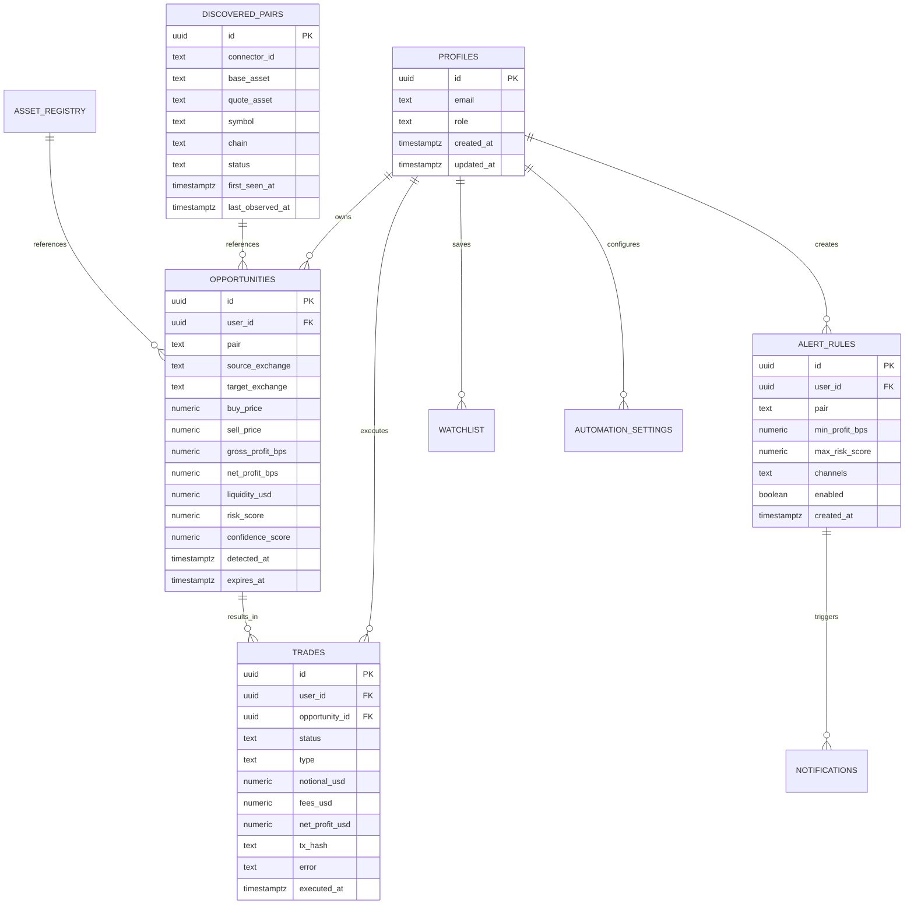

**See also:** [13_SECURITY_ARCHITECTURE.md](13_SECURITY_ARCHITECTURE.md), [16_API_SPECIFICATION.md](16_API_SPECIFICATION.md), [17_BACKEND_SPECIFICATION.md](17_BACKEND_SPECIFICATION.md)
# Database Schema

**Document:** Phase 3 — Auth + Multi-Tenant
**Cross-References:** [13_SECURITY_ARCHITECTURE.md](13_SECURITY_ARCHITECTURE.md), [05_MONOREPO_STRUCTURE.md](05_MONOREPO_STRUCTURE.md)

---

## 1. Overview

PostgreSQL schema for ARBITRAGE-PRO, managed via Supabase migrations. All tables use Row-Level Security (RLS) for multi-tenant isolation.

**Key Properties:**
- UUID primary keys — No enumeration
- Timestamps — All tables have `created_at`, `updated_at`
- Soft deletes — `deleted_at` instead of DELETE
- RLS enabled — All tables enforce user isolation
- Indexed — All foreign keys and frequently queried columns

---

## 2. Entity Relationship Diagram



---

## 3. Core Tables

### 3.1 profiles

```sql
CREATE TABLE IF NOT EXISTS profiles (
  id UUID PRIMARY KEY REFERENCES auth.users(id) ON DELETE CASCADE,
  email TEXT UNIQUE NOT NULL,
  role TEXT DEFAULT 'user' CHECK (role IN ('user', 'premium', 'admin')),
  
  -- Risk preferences
  risk_tier TEXT DEFAULT 'manual' CHECK (risk_tier IN ('manual', 'simulated', 'automated')),
  max_auto_notional_usd NUMERIC(20,8) DEFAULT 100,
  max_auto_risk_score NUMERIC(5,2) DEFAULT 60,
  daily_loss_cap_usd NUMERIC(20,8) DEFAULT 50,
  auto_paused_until TIMESTAMPTZ,
  
  -- Notification preferences
  expo_push_token TEXT,
  email_notifications BOOLEAN DEFAULT true,
  push_notifications BOOLEAN DEFAULT true,
  
  -- Metadata
  metadata JSONB DEFAULT '{}',
  
  -- Timestamps
  created_at TIMESTAMPTZ DEFAULT now(),
  updated_at TIMESTAMPTZ DEFAULT now(),
  
  -- Indexes
  CONSTRAINT email_format CHECK (email ~* '^[A-Za-z0-9._%+-]+@[A-Za-z0-9.-]+\.[A-Za-z]{2,}$')
);

CREATE INDEX idx_profiles_email ON profiles(email);
CREATE INDEX idx_profiles_role ON profiles(role);
CREATE INDEX idx_profiles_risk_tier ON profiles(risk_tier);

-- Trigger for updated_at
CREATE OR REPLACE FUNCTION update_profiles_updated_at()
RETURNS TRIGGER AS $$
BEGIN
  NEW.updated_at = now();
  RETURN NEW;
END;
$$ LANGUAGE plpgsql;

CREATE TRIGGER profiles_updated_at
  BEFORE UPDATE ON profiles
  FOR EACH ROW EXECUTE FUNCTION update_profiles_updated_at();

-- RLS
ALTER TABLE profiles ENABLE ROW LEVEL SECURITY;

CREATE POLICY "Users can view own profile"
  ON profiles FOR SELECT
  TO authenticated
  USING (auth.uid() = id);

CREATE POLICY "Users can update own profile"
  ON profiles FOR UPDATE
  TO authenticated
  USING (auth.uid() = id);

CREATE POLICY "Service role has full access"
  ON profiles FOR ALL
  TO service_role
  USING (true);
```

### 3.2 opportunities

```sql
CREATE TABLE IF NOT EXISTS opportunities (
  id UUID PRIMARY KEY DEFAULT gen_random_uuid(),
  user_id UUID NOT NULL REFERENCES auth.users(id) ON DELETE CASCADE,
  
  -- Opportunity details
  type TEXT NOT NULL CHECK (type IN ('spatial', 'triangular', 'cross-chain')),
  pair TEXT NOT NULL,
  source_exchange TEXT NOT NULL,
  target_exchange TEXT NOT NULL,
  
  -- Prices
  buy_price NUMERIC(20,8) NOT NULL,
  sell_price NUMERIC(20,8) NOT NULL,
  gross_profit_bps NUMERIC(10,4) NOT NULL,
  fees_bps NUMERIC(10,4) NOT NULL,
  net_profit_bps NUMERIC(10,4) NOT NULL,
  
  -- Risk metrics
  liquidity_usd NUMERIC(20,2) NOT NULL,
  risk_score NUMERIC(5,2) NOT NULL,
  confidence_score NUMERIC(5,2) NOT NULL,
  risk_breakdown JSONB,
  
  -- Cross-chain specific
  bridge_fee_bps NUMERIC(10,4),
  bridge_estimated_time INT,
  source_chain TEXT,
  target_chain TEXT,
  
  -- Timestamps
  detected_at TIMESTAMPTZ DEFAULT now(),
  expires_at TIMESTAMPTZ NOT NULL,
  
  -- Metadata
  metadata JSONB DEFAULT '{}',
  
  -- Indexes
  CONSTRAINT valid_profit CHECK (net_profit_bps >= 0)
);

CREATE INDEX idx_opportunities_user_id ON opportunities(user_id);
CREATE INDEX idx_opportunities_detected_at ON opportunities(detected_at DESC);
CREATE INDEX idx_opportunities_pair ON opportunities(pair);
CREATE INDEX idx_opportunities_net_profit ON opportunities(net_profit_bps DESC);
CREATE INDEX idx_opportunities_type ON opportunities(type);

-- RLS
ALTER TABLE opportunities ENABLE ROW LEVEL SECURITY;

CREATE POLICY "Users can view own opportunities"
  ON opportunities FOR SELECT
  TO authenticated
  USING (auth.uid() = user_id);

CREATE POLICY "Service role can insert opportunities"
  ON opportunities FOR INSERT
  TO service_role
  WITH CHECK (true);

CREATE POLICY "Users can delete own opportunities"
  ON opportunities FOR DELETE
  TO authenticated
  USING (auth.uid() = user_id);

-- Auto-delete expired opportunities
CREATE OR REPLACE FUNCTION delete_expired_opportunities()
RETURNS TRIGGER AS $$
BEGIN
  DELETE FROM opportunities WHERE expires_at < now();
  RETURN NULL;
END;
$$ LANGUAGE plpgsql;

CREATE TRIGGER opportunities_cleanup
  AFTER INSERT ON opportunities
  FOR EACH STATEMENT EXECUTE FUNCTION delete_expired_opportunities();
```

### 3.3 trades

```sql
CREATE TABLE IF NOT EXISTS trades (
  id UUID PRIMARY KEY DEFAULT gen_random_uuid(),
  user_id UUID NOT NULL REFERENCES auth.users(id) ON DELETE CASCADE,
  opportunity_id UUID REFERENCES opportunities(id) ON DELETE SET NULL,
  
  -- Trade details
  status TEXT NOT NULL CHECK (status IN ('dry_run', 'submitted', 'filled', 'failed', 'denied_safety', 'cancelled')),
  type TEXT NOT NULL CHECK (type IN ('manual', 'simulated', 'automated')),
  
  -- Execution
  exchange TEXT NOT NULL,
  pair TEXT NOT NULL,
  side TEXT NOT NULL CHECK (side IN ('buy', 'sell')),
  order_type TEXT DEFAULT 'market' CHECK (order_type IN ('market', 'limit')),
  
  -- Amounts
  quantity NUMERIC(20,8) NOT NULL,
  price NUMERIC(20,8) NOT NULL,
  notional_usd NUMERIC(20,2) NOT NULL,
  
  -- Fees
  fees_usd NUMERIC(20,4) NOT NULL DEFAULT 0,
  gas_cost_usd NUMERIC(20,4) NOT NULL DEFAULT 0,
  net_profit_usd NUMERIC(20,4),
  
  -- Blockchain
  tx_hash TEXT,
  block_number BIGINT,
  gas_used BIGINT,
  
  -- Error handling
  error_message TEXT,
  error_stack TEXT,
  
  -- Timestamps
  executed_at TIMESTAMPTZ DEFAULT now(),
  filled_at TIMESTAMPTZ,
  
  -- Metadata
  metadata JSONB DEFAULT '{}'
);

CREATE INDEX idx_trades_user_id ON trades(user_id);
CREATE INDEX idx_trades_opportunity_id ON trades(opportunity_id);
CREATE INDEX idx_trades_status ON trades(status);
CREATE INDEX idx_trades_executed_at ON trades(executed_at DESC);
CREATE INDEX idx_trades_type ON trades(type);

-- RLS
ALTER TABLE trades ENABLE ROW LEVEL SECURITY;

CREATE POLICY "Users can view own trades"
  ON trades FOR SELECT
  TO authenticated
  USING (auth.uid() = user_id);

CREATE POLICY "Service role can insert trades"
  ON trades FOR INSERT
  TO service_role
  WITH CHECK (true);

CREATE POLICY "Users can cancel own pending trades"
  ON trades FOR UPDATE
  TO authenticated
  USING (auth.uid() = user_id AND status IN ('dry_run', 'submitted'))
  WITH CHECK (status = 'cancelled');
```

### 3.4 alert_rules

```sql
CREATE TABLE IF NOT EXISTS alert_rules (
  id UUID PRIMARY KEY DEFAULT gen_random_uuid(),
  user_id UUID NOT NULL REFERENCES auth.users(id) ON DELETE CASCADE,
  
  -- Rule definition
  name TEXT NOT NULL,
  pair TEXT NOT NULL,
  exchange TEXT,
  chain TEXT,
  
  -- Conditions
  min_profit_bps NUMERIC(10,4) NOT NULL,
  max_risk_score NUMERIC(5,2),
  min_confidence_score NUMERIC(5,2),
  
  -- Notification channels
  channels JSONB NOT NULL DEFAULT '["push"]' CHECK (channels <@ '["push", "email", "webhook"]'),
  webhook_url TEXT,
  
  -- Throttling
  cooldown_seconds INT DEFAULT 300 CHECK (cooldown_seconds >= 0),
  last_triggered_at TIMESTAMPTZ,
  
  -- Status
  enabled BOOLEAN DEFAULT true,
  
  -- Timestamps
  created_at TIMESTAMPTZ DEFAULT now(),
  updated_at TIMESTAMPTZ DEFAULT now(),
  
  -- Indexes
  CONSTRAINT valid_profit CHECK (min_profit_bps >= 0)
);

CREATE INDEX idx_alert_rules_user_id ON alert_rules(user_id);
CREATE INDEX idx_alert_rules_enabled ON alert_rules(enabled);
CREATE INDEX idx_alert_rules_pair ON alert_rules(pair);

-- RLS
ALTER TABLE alert_rules ENABLE ROW LEVEL SECURITY;

CREATE POLICY "Users can manage own alert rules"
  ON alert_rules FOR ALL
  TO authenticated
  USING (auth.uid() = user_id)
  WITH CHECK (auth.uid() = user_id);

CREATE POLICY "Service role can read alert rules"
  ON alert_rules FOR SELECT
  TO service_role
  USING (true);
```

### 3.5 watchlist

```sql
CREATE TABLE IF NOT EXISTS watchlist (
  id UUID PRIMARY KEY DEFAULT gen_random_uuid(),
  user_id UUID NOT NULL REFERENCES auth.users(id) ON DELETE CASCADE,
  opportunity_id UUID REFERENCES opportunities(id) ON DELETE CASCADE,
  
  -- User notes
  notes TEXT,
  tags TEXT[],
  
  -- Timestamps
  created_at TIMESTAMPTZ DEFAULT now(),
  
  -- Unique constraint
  UNIQUE(user_id, opportunity_id)
);

CREATE INDEX idx_watchlist_user_id ON watchlist(user_id);
CREATE INDEX idx_watchlist_opportunity_id ON watchlist(opportunity_id);

-- RLS
ALTER TABLE watchlist ENABLE ROW LEVEL SECURITY;

CREATE POLICY "Users can manage own watchlist"
  ON watchlist FOR ALL
  TO authenticated
  USING (auth.uid() = user_id)
  WITH CHECK (auth.uid() = user_id);
```

---

## 4. Discovery Tables

### 4.1 discovered_pairs

```sql
CREATE TABLE IF NOT EXISTS discovered_pairs (
  id UUID PRIMARY KEY DEFAULT gen_random_uuid(),
  connector_id TEXT NOT NULL,
  base_asset TEXT NOT NULL,
  quote_asset TEXT NOT NULL,
  symbol TEXT NOT NULL,
  chain TEXT,
  contract_address TEXT,
  normalized_base TEXT,
  normalized_quote TEXT,
  status TEXT DEFAULT 'active' CHECK (status IN ('active', 'delisted', 'paused', 'maintenance')),
  first_seen_at TIMESTAMPTZ DEFAULT now(),
  last_observed_at TIMESTAMPTZ DEFAULT now(),
  
  UNIQUE(connector_id, symbol)
);

CREATE INDEX idx_discovered_pairs_connector ON discovered_pairs(connector_id);
CREATE INDEX idx_discovered_pairs_status ON discovered_pairs(status);
CREATE INDEX idx_discovered_pairs_last_observed ON discovered_pairs(last_observed_at);

-- RLS
ALTER TABLE discovered_pairs ENABLE ROW LEVEL SECURITY;

CREATE POLICY "Service role can manage discovered pairs"
  ON discovered_pairs FOR ALL
  TO service_role
  USING (true);

CREATE POLICY "Authenticated users can view discovered pairs"
  ON discovered_pairs FOR SELECT
  TO authenticated
  USING (true);
```

### 4.2 asset_registry

```sql
CREATE TABLE IF NOT EXISTS asset_registry (
  id UUID PRIMARY KEY DEFAULT gen_random_uuid(),
  asset_id TEXT NOT NULL UNIQUE,
  canonical TEXT NOT NULL,
  identity_type TEXT NOT NULL,
  base_asset TEXT NOT NULL,
  quote_asset TEXT NOT NULL,
  venue_code TEXT NOT NULL,
  chain TEXT,
  contract_address TEXT,
  decimals INT NOT NULL,
  status TEXT DEFAULT 'active',
  metadata JSONB DEFAULT '{}',
  first_seen_at TIMESTAMPTZ DEFAULT now(),
  last_observed_at TIMESTAMPTZ DEFAULT now()
);

CREATE INDEX idx_asset_registry_canonical ON asset_registry(canonical);
CREATE INDEX idx_asset_registry_chain ON asset_registry(chain);
CREATE INDEX idx_asset_registry_venue ON asset_registry(venue_code);

-- RLS
ALTER TABLE asset_registry ENABLE ROW LEVEL SECURITY;

CREATE POLICY "Service role can manage asset registry"
  ON asset_registry FOR ALL
  TO service_role
  USING (true);

CREATE POLICY "Authenticated users can view asset registry"
  ON asset_registry FOR SELECT
  TO authenticated
  USING (true);
```

---

## 5. Execition Tables

### 5.1 automation_settings

```sql
CREATE TABLE IF NOT EXISTS automation_settings (
  id UUID PRIMARY KEY DEFAULT gen_random_uuid(),
  user_id UUID UNIQUE NOT NULL REFERENCES auth.users(id) ON DELETE CASCADE,
  
  -- Limits
  max_auto_notional_usd NUMERIC(20,8) DEFAULT 100,
  max_auto_risk_score NUMERIC(5,2) DEFAULT 60,
  daily_loss_cap_usd NUMERIC(20,8) DEFAULT 50,
  
  -- Cooldowns
  min_trade_interval_seconds INT DEFAULT 30,
  max_trades_per_hour INT DEFAULT 10,
  max_trades_per_day INT DEFAULT 50,
  
  -- Controls
  auto_paused_until TIMESTAMPTZ,
  allowed_pairs TEXT[],
  blocked_pairs TEXT[],
  allowed_exchanges TEXT[],
  blocked_exchanges TEXT[],
  
  -- Timestamps
  created_at TIMESTAMPTZ DEFAULT now(),
  updated_at TIMESTAMPTZ DEFAULT now()
);

CREATE INDEX idx_automation_settings_user_id ON automation_settings(user_id);

-- RLS
ALTER TABLE automation_settings ENABLE ROW LEVEL SECURITY;

CREATE POLICY "Users can manage own automation settings"
  ON automation_settings FOR ALL
  TO authenticated
  USING (auth.uid() = user_id)
  WITH CHECK (auth.uid() = user_id);
```

---

## 6. System Tables

### 6.1 audit_log

```sql
CREATE TABLE IF NOT EXISTS audit_log (
  id UUID PRIMARY KEY DEFAULT gen_random_uuid(),
  user_id UUID REFERENCES auth.users(id) ON DELETE SET NULL,
  event_type TEXT NOT NULL,
  timestamp TIMESTAMPTZ DEFAULT now(),
  ip INET,
  user_agent TEXT,
  metadata JSONB DEFAULT '{}',
  
  -- Indexes
  CONSTRAINT valid_event_type CHECK (length(event_type) > 0)
);

CREATE INDEX idx_audit_user ON audit_log(user_id);
CREATE INDEX idx_audit_timestamp ON audit_log(timestamp DESC);
CREATE INDEX idx_audit_event_type ON audit_log(event_type);

-- RLS
ALTER TABLE audit_log ENABLE ROW LEVEL SECURITY;

CREATE POLICY "Users can view own audit log"
  ON audit_log FOR SELECT
  TO authenticated
  USING (auth.uid() = user_id);

CREATE POLICY "Service role can insert audit log"
  ON audit_log FOR INSERT
  TO service_role
  WITH CHECK (true);

-- Prevent updates/deletes
REVOKE UPDATE, DELETE ON audit_log FROM service_role;
REVOKE UPDATE, DELETE ON audit_log FROM authenticated;
```

### 6.2 connector_health

```sql
CREATE TABLE IF NOT EXISTS connector_health (
  id UUID PRIMARY KEY DEFAULT gen_random_uuid(),
  connector_id TEXT NOT NULL,
  status TEXT NOT NULL CHECK (status IN ('active', 'degraded', 'maintenance')),
  latency_ms INT,
  error_rate_24h NUMERIC(5,4),
  uptime_24h NUMERIC(5,4),
  last_error TEXT,
  checked_at TIMESTAMPTZ DEFAULT now(),
  
  UNIQUE(connector_id)
);

CREATE INDEX idx_connector_health_id ON connector_health(connector_id);
CREATE INDEX idx_connector_health_checked_at ON connector_health(checked_at DESC);

-- RLS
ALTER TABLE connector_health ENABLE ROW LEVEL SECURITY;

CREATE POLICY "Authenticated users can view connector health"
  ON connector_health FOR SELECT
  TO authenticated
  USING (true);

CREATE POLICY "Service role can manage connector health"
  ON connector_health FOR ALL
  TO service_role
  USING (true);
```

---

## 7. Migrations

### 7.1 Migration Naming Convention

```
{YYYYMMDDHHMMSS}_{description}.sql

Examples:
20260626173000_initial_arbitrage_pro_schema.sql
20260630_connector_id_link.sql
20260630_dex_pools.sql
20260630_automation_settings.sql
```

### 7.2 Migration Template

```sql
-- Migration: {description}
-- Created: {timestamp}
-- Author: {author}

BEGIN;

-- Up migration
CREATE TABLE IF NOT EXISTS ...

-- Down migration (commented, for rollback)
-- DROP TABLE IF EXISTS ...

COMMIT;
```

---

## 8. Indexes

### 8.1 Composite Indexes

```sql
-- Opportunities: user + time
CREATE INDEX idx_opportunities_user_detected 
  ON opportunities(user_id, detected_at DESC);

-- Opportunities: pair + profit
CREATE INDEX idx_opportunities_pair_profit 
  ON opportunities(pair, net_profit_bps DESC);

-- Trades: user + status + time
CREATE INDEX idx_trades_user_status_time 
  ON trades(user_id, status, executed_at DESC);

-- Discovered pairs: connector + status
CREATE INDEX idx_discovered_pairs_connector_status 
  ON discovered_pairs(connector_id, status);
```

---

## 9. Performance Optimization

### 9.1 Query Plans

```sql
-- Use EXPLAIN ANALYZE for slow queries
EXPLAIN ANALYZE 
SELECT * FROM opportunities 
WHERE user_id = 'xxx' AND detected_at > now() - interval '1 hour'
ORDER BY net_profit_bps DESC;

-- Expected: Index Scan on idx_opportunities_user_detected
```

### 9.2 Vacuum & Analyze

```sql
-- Auto-vacuum settings
ALTER TABLE opportunities SET (
  autovacuum_vacuum_scale_factor = 0.01,
  autovacuum_analyze_scale_factor = 0.005
);

-- Manual vacuum if needed
VACUUM ANALYZE opportunities;
```

---

## 10. Backup & Restore

### 10.1 Supabase Backups

- Automated daily backups (retained 7 days)
- Point-in-time recovery (PITR) available
- Manual backup before migrations

```bash
# Export schema
supabase db dump --schema public > schema.sql

# Export data
supabase db dump --data-only > data.sql

# Restore
psql -d <database> < schema.sql
psql -d <database> < data.sql
```

---

## 11. Acceptance Criteria

- [ ] All tables defined with RLS
- [ ] Indexes on all foreign keys
- [ ] Composite indexes for common queries
- [ ] Triggers for updated_at
- [ ] Auto-delete for expired opportunities
- [ ] Migrations are reversible
- [ ] Backup strategy documented
- [ ] Performance tested with 1M rows

## Engineering Notes

- Use UUIDs for all primary keys
- Never use DELETE — use soft deletes
- All timestamps in TIMESTAMPTZ (UTC)
- RLS on all tables — no exceptions
- Service role bypasses RLS for backend
- Monitor slow queries in production