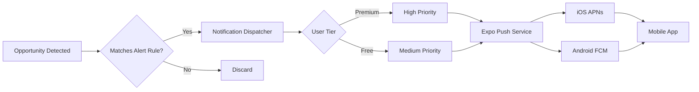

**See also:** [18_MOBILE_SPECIFICATION.md](18_MOBILE_SPECIFICATION.md), [16_API_SPECIFICATION.md](16_API_SPECIFICATION.md), [20_BIOMETRIC_SECURITY.md](20_BIOMETRIC_SECURITY.md)
# Push Notifications

**Document:** Phase 5 — Mobile + Alerts
**Cross-References:** [18_MOBILE_SPECIFICATION.md](18_MOBILE_SPECIFICATION.md), [17_BACKEND_SPECIFICATION.md](17_BACKEND_SPECIFICATION.md)

---

## 1. Overview

Push notification system for ARBITRAGE-PRO. Delivers real-time alerts for arbitrage opportunities, trade executions, and system events to iOS and Android devices.

**Key Properties:**
- Expo Push Notifications service
- Token management per user
- Topic-based subscriptions
- Priority routing (high/medium/low)
- Retry logic with exponential backoff

---

## 2. Architecture



---

## 3. Implementation

### 3.1 Token Registration

```typescript
// apps/mobile/src/services/notifications.ts
export class NotificationService {
  private expoPushToken: string | null = null;
  
  async register() {
    const { status: existingStatus } = await Notifications.getPermissionsAsync();
    
    if (existingStatus !== 'granted') {
      const { status } = await Notifications.requestPermissionsAsync();
      if (status !== 'granted') {
        throw new Error('Notification permission denied');
      }
    }
    
    const token = await Notifications.getExpoPushTokenAsync({
      projectId: 'your-project-id'
    });
    
    this.expoPushToken = token.data;
    
    // Save to user profile
    await supabase
      .from('profiles')
      .update({ expo_push_token: this.expoPushToken })
      .eq('id', userId);
  }
}
```

### 3.2 Backend Dispatcher

```typescript
// packages/alerts/src/dispatcher.ts
export class AlertDispatcher {
  constructor(private expo: ExpoPushService) {}
  
  async dispatch(rule: AlertRule, opportunities: ArbitrageOpportunity[]): Promise<void> {
    // Get user's push token
    const profile = await this.getProfile(rule.userId);
    if (!profile.expoPushToken) return;
    
    // Build notification
    const messages = opportunities.map(opp => ({
      to: profile.expo_push_token,
      sound: 'default',
      title: `Arbitrage Opportunity: ${opp.pair}`,
      body: `+${opp.netProfitBps.toFixed(2)} bps on ${opp.targetExchange}`,
      data: {
        opportunityId: opp.id,
        pair: opp.pair,
        profit: opp.netProfitBps
      },
      priority: 'high'
    }));
    
    // Send in batches
    const chunks = chunk(messages, 100);
    for (const chunk of chunks) {
      await this.sendBatch(chunk);
    }
  }
  
  private async sendBatch(messages: ExpoPushMessage[]): Promise<void> {
    const tickets = await this.expo.sendPushNotificationsAsync(messages);
    
    // Handle receipts
    const receiptIds = tickets
      .filter(t => t.status === 'ok')
      .map(t => t.id);
    
    if (receiptIds.length > 0) {
      const receipts = await this.expo.getPushNotificationReceiptsAsync(receiptIds);
      
      // Log failures
      for (const [id, receipt] of Object.entries(receipts)) {
        if (receipt.status === 'error') {
          logger.error({ id, error: receipt.message }, 'Push notification failed');
        }
      }
    }
  }
}
```

---

## 4. Notification Types

### 4.1 Opportunity Alert

```typescript
export interface OpportunityNotification {
  readonly title: string;
  readonly body: string;
  readonly data: {
    readonly type: 'opportunity';
    readonly opportunityId: string;
    readonly pair: string;
    readonly profitBps: number;
    readonly riskScore: number;
    readonly action: 'view' | 'execute';
  };
}
```

### 4.2 Trade Execution

```typescript
export interface TradeNotification {
  readonly title: string;
  readonly body: string;
  readonly data: {
    readonly type: 'trade';
    readonly tradeId: string;
    readonly status: 'submitted' | 'filled' | 'failed';
    readonly profitUsd?: number;
    readonly action: 'view';
  };
}
```

### 4.3 System Alert

```typescript
export interface SystemNotification {
  readonly title: string;
  readonly body: string;
  readonly data: {
    readonly type: 'system';
    readonly severity: 'info' | 'warning' | 'error';
    readonly message: string;
    readonly action: 'dismiss';
  };
}
```

---

## 5. iOS Configuration

### 5.1 APNs Setup

```json
// app.json
{
  "expo": {
    "ios": {
      "bundleIdentifier": "com.arbitragepro.mobile",
      "pushNotification": {
        "projectId": "your-firebase-project-id"
      }
    }
  }
}
```

### 5.2 Permissions

```tsx
// Request permissions on app launch
useEffect(() => {
  Notifications.requestPermissionsAsync();
}, []);
```

### 5.3 Categories

```typescript
const notificationCategories = [
  {
    name: 'opportunity',
    actions: [
      { buttonTitle: 'View', inlineAuthId: 'view', destructive: false },
      { buttonTitle: 'Execute', inlineAuthId: 'execute', destructive: false }
    ]
  },
  {
    name: 'trade',
    actions: [
      { buttonTitle: 'View Details', inlineAuthId: 'view' }
    ]
  }
];
```

---

## 6. Android Configuration

### 6.1 FCM Setup

```json
// app.json
{
  "expo": {
    "android": {
      "package": "com.arbitragepro.mobile",
      "googleServicesFile": "./google-services.json",
      "notification": {
        "icon": "ic_notification",
        "channelId": "arbitrage-pro",
        "color": "#2563eb"
      }
    }
  }
}
```

### 6.2 Channels

```typescript
await Notifications.setNotificationChannelAsync('arbitrage-pro', {
  name: 'Arbitrage Opportunities',
  importance: Notifications.AndroidImportance.MAX,
  vibrationPattern: [0, 250, 250, 250],
  lightColor: '#2563eb'
});
```

---

## 7. Foreground Handling

### 7.1 Listener

```tsx
// src/hooks/use-push-notifications.ts
export function usePushNotifications() {
  useEffect(() => {
    const subscription = Notifications.addNotificationReceivedListener(notification => {
      // Show in-app banner
      showInAppNotification(notification);
    });
    
    const responseSubscription = Notifications.addNotificationResponseReceivedListener(response => {
      // Handle tap
      handleNotificationTap(response);
    });
    
    return () => {
      subscription.remove();
      responseSubscription.remove();
    };
  }, []);
}
```

### 7.2 In-App Banner

```tsx
export function InAppNotification({ notification }) {
  if (!notification) return null;
  
  return (
    <Animated.View style={styles.banner}>
      <Text style={styles.title}>{notification.request.content.title}</Text>
      <Text style={styles.body}>{notification.request.content.body}</Text>
    </Animated.View>
  );
}
```

---

## 8. Testing

### 8.1 Unit Tests

```typescript
describe('NotificationService', () => {
  it('registers for push notifications', async () => {
    const service = new NotificationService();
    await service.register();
    
    expect(service.expoPushToken).toBeDefined();
  });
});
```

### 8.2 Integration Tests

```typescript
describe('Push Notification Flow', () => {
  it('receives opportunity notification', async () => {
    // Trigger opportunity
    await triggerOpportunity();
    
    // Wait for notification
    const notification = await waitForNotification();
    
    expect(notification.title).toContain('Arbitrage Opportunity');
  });
});
```

---

## 9. Monitoring

### 9.1 Metrics

```typescript
export const NOTIFICATION_METRICS = {
  sent: new promClient.Counter({
    name: 'notifications_sent_total',
    help: 'Total notifications sent',
    labelNames: ['type', 'priority']
  }),
  delivered: new promClient.Counter({
    name: 'notifications_delivered_total',
    help: 'Total notifications delivered',
    labelNames: ['type', 'platform']
  }),
  failed: new promClient.Counter({
    name: 'notifications_failed_total',
    help: 'Total notifications failed',
    labelNames: ['type', 'reason']
  })
};
```

### 9.2 Dashboard

```typescript
// Health endpoint
{
  "notifications": {
    "sent24h": 12500,
    "delivered24h": 11800,
    "failed24h": 700,
    "successRate": 0.944,
    "avgDeliveryTimeMs": 450
  }
}
```

---

## 10. Acceptance Criteria

- [ ] Token registration works
- [ ] Opportunity notifications sent
- [ ] Trade execution notifications sent
- [ ] System alerts sent
- [ ] Foreground handling works
- [ ] Background handling works
- [ ] Tap action navigates to screen
- [ ] Retry on failure
- [ ] Tests pass (70% coverage)

## Engineering Notes

- Expo Push service has rate limits
- Tokens expire — refresh regularly
- iOS requires explicit permission
- Android channels control importance
- Test on real devices