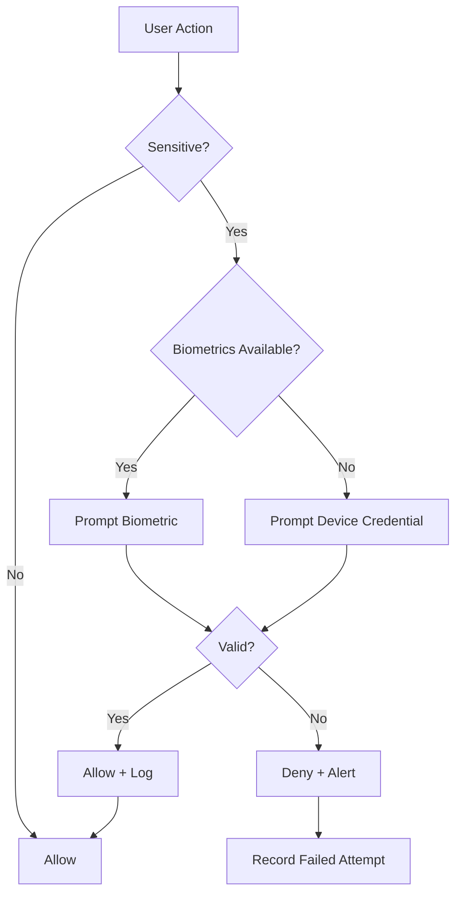

# Biometric Security

**Document:** Phase 5 — Mobile + Alerts
**Cross-References:** [18_MOBILE_SPECIFICATION.md](18_MOBILE_SPECIFICATION.md), [19_PUSH_NOTIFICATIONS.md](19_PUSH_NOTIFICATIONS.md), [13_SECURITY_ARCHITECTURE.md](13_SECURITY_ARCHITECTURE.md)

---

## 1. Overview

Biometric authentication for mobile devices. Enforces Class 3 biometrics (Face ID, fingerprint) for trade execution and sensitive operations.

**Key Properties:**
- Class 3 biometrics only
- Device credential fallback
- Secure storage for sessions
- Timeout-based re-authentication
- Audit logging for biometric events

---

## 2. Architecture



---

## 3. Implementation

### 3.1 Biometric Gate

```typescript
// apps/mobile/src/auth/biometric-auth.ts
export class BiometricGate {
  async require(reason: string): Promise<boolean> {
    const { available, biometryType } = await LocalAuthentication.authenticateAsync({
      promptMessage: reason,
      fallbackPromptMessage: 'Use device passcode',
      disableDeviceFallback: false,
      cancelLabel: 'Cancel'
    });
    
    if (!available) {
      // Fallback to device credential
      return this.promptDeviceCredential(reason);
    }
    
    // Enforce Class 3 biometrics only
    if (!this.isClass3(biometryType)) {
      throw new SecurityError('Insufficient biometric security');
    }
    
    // Log success
    await this.auditLogger.log({
      type: AuditEventType.BIOMETRIC_AUTH_SUCCESS,
      metadata: { biometryType, reason }
    });
    
    return true;
  }
  
  private isClass3(biometryType: LocalAuthentication.BIOMETRY_TYPE): boolean {
    // iOS: Face ID is Class 3, Touch ID is Class 1
    // Android: Fingerprint is Class 3
    
    if (Platform.OS === 'ios') {
      return biometryType === LocalAuthentication.BIOMETRY_TYPE_FACE_ID;
    }
    
    if (Platform.OS === 'android') {
      return biometryType === LocalAuthentication.BIOMETRY_TYPE_FINGERPRINT;
    }
    
    return false;
  }
}
```

### 3.2 Device Credential Fallback

```typescript
private async promptDeviceCredential(reason: string): Promise<boolean> {
  try {
    const { success } = await LocalAuthentication.authenticateAsync({
      promptMessage: reason,
      disableDeviceFallback: false
    });
    
    if (success) {
      await this.auditLogger.log({
        type: AuditEventType.DEVICE_CREDENTIAL_SUCCESS,
        metadata: { reason }
      });
    }
    
    return success;
  } catch (error) {
    await this.auditLogger.log({
      type: AuditEventType.DEVICE_CREDENTIAL_FAILED,
      metadata: { reason, error: error.message }
    });
    
    return false;
  }
}
```

### 3.3 Trade Execution Gate

```typescript
// src/hooks/use-trade-execution.ts
export function useTradeExecution() {
  const biometricGate = new BiometricGate();
  
  const execute = async (opportunityId: string) => {
    // Require biometric auth for trade execution
    const authorized = await biometricGate.require(
      'Authenticate to execute trade'
    );
    
    if (!authorized) {
      throw new Error('Biometric authentication failed');
    }
    
    // Execute trade
    return api.executeOpportunity(opportunityId);
  };
  
  return { execute };
}
```

---

## 4. Session Management

### 4.1 Session Storage

```typescript
export class SecureSessionManager {
  private readonly SESSION_KEY = 'auth_session';
  private readonly SESSION_TIMEOUT = 15 * 60 * 1000; // 15 minutes
  
  async saveSession(session: Session): Promise<void> {
    const encrypted = await this.encrypt(session);
    await SecureStore.setItemAsync(this.SESSION_KEY, encrypted);
  }
  
  async getSession(): Promise<Session | null> {
    const encrypted = await SecureStore.getItemAsync(this.SESSION_KEY);
    if (!encrypted) return null;
    
    const session = await this.decrypt(encrypted);
    
    // Check timeout
    if (Date.now() - session.lastActivity > this.SESSION_TIMEOUT) {
      await this.clearSession();
      return null;
    }
    
    // Update last activity
    session.lastActivity = Date.now();
    await this.saveSession(session);
    
    return session;
  }
  
  async clearSession(): Promise<void> {
    await SecureStore.deleteItemAsync(this.SESSION_KEY);
  }
}
```

---

## 5. Biometric Types

### 5.1 Android Biometric Strength

| Strength | Type | Allowed |
|---|---|---|
| Class 2 | Fingerprint | No |
| Class 3 | Fingerprint (strong) | Yes |
| Class 3 | Face (strong) | Yes |

### 5.2 iOS Biometric Strength

| Type | Class | Allowed |
|---|---|---|
| Touch ID | Class 1 | No |
| Face ID | Class 3 | Yes |

---

## 6. Configuration

### 6.1 Enabled Actions

```typescript
export const BIOMETRIC_REQUIRED_ACTIONS = [
  'trade.execute',
  'settings.change',
  'alert.delete',
  'watchlist.share'
];

export const BIOMETRIC_OPTIONAL_ACTIONS = [
  'view.history'
];
```

### 6.2 User Preferences

```typescript
export interface BiometricSettings {
  enabled: boolean;
  requiredForTrades: boolean;
  requiredForSettings: boolean;
  timeout: number; // seconds
}

export const DEFAULT_BIOMETRIC_SETTINGS: BiometricSettings = {
  enabled: true,
  requiredForTrades: true,
  requiredForSettings: false,
  timeout: 900 // 15 minutes
};
```

---

## 7. Testing

### 7.1 Unit Tests

```typescript
describe('BiometricGate', () => {
  it('allows Class 3 biometrics', async () => {
    const gate = new BiometricGate();
    
    // Mock Face ID (Class 3)
    jest.spyOn(LocalAuthentication, 'getEnrolledLevelAsync').mockResolvedValue(3);
    
    const result = await gate.require('Test');
    expect(result).toBe(true);
  });
  
  it('rejects Class 1 biometrics', async () => {
    const gate = new BiometricGate();
    
    // Mock Touch ID (Class 1)
    jest.spyOn(LocalAuthentication, 'getEnrolledLevelAsync').mockResolvedValue(1);
    
    await expect(gate.require('Test')).rejects.toThrow(SecurityError);
  });
});
```

### 7.2 Integration Tests

```typescript
describe('Biometric Login Flow', () => {
  it('authenticates with Face ID', async () => {
    render(<LoginScreen />);
    
    // Simulate Face ID success
    await userEvent.press(screen.getByText('Login with Face ID'));
    
    expect(await screen.findByText('Home')).toBeTruthy();
  });
});
```

---

## 8. Security Considerations

### 8.1 Threat Mitigations

| Threat | Mitigation |
|---|---|
| Biometric spoofing | Class 3 only |
| Replay attacks | Timestamp validation |
| Device theft | Secure storage + timeout |
| Root/jailbreak | Device integrity check |

### 8.2 Device Integrity

```typescript
export class DeviceIntegrityChecker {
  async check(): Promise<boolean> {
    if (Platform.OS === 'android') {
      return this.checkAndroidIntegrity();
    }
    
    if (Platform.OS === 'ios') {
      return this.checkIOSIntegrity();
    }
    
    return false;
  }
  
  private async checkAndroidIntegrity(): Promise<boolean> {
    // Check for root
    const isRooted = await RootDetection.check();
    if (isRooted) return false;
    
    // Check Play Integrity API
    const integrity = await PlayIntegrity.requestIntegrityToken();
    return integrity.verdict === 'MEETS_STRONG_INTEGRITY';
  }
  
  private async checkIOSIntegrity(): Promise<boolean> {
    // Check for jailbreak
    const isJailbroken = await JailbreakDetection.check();
    if (isJailbroken) return false;
    
    return true;
  }
}
```

---

## 9. Audit Logging

```typescript
export enum BiometricAuditEvent {
  AUTH_SUCCESS = 'biometric.auth.success',
  AUTH_FAILED = 'biometric.auth.failed',
  DEVICE_CREDENTIAL_SUCCESS = 'biometric.device_credential.success',
  DEVICE_CREDENTIAL_FAILED = 'biometric.device_credential.failed',
  BIOMETRIC_DISABLED = 'biometric.disabled'
}

export class BiometricAuditLogger {
  async log(event: BiometricAuditEvent, metadata: any): Promise<void> {
    await this.auditLogger.log({
      userId: this.userId,
      type: event,
      metadata
    });
  }
}
```

---

## 10. Acceptance Criteria

- [ ] Class 3 biometrics enforced
- [ ] Class 1 biometrics rejected
- [ ] Device credential fallback works
- [ ] Session timeout enforced
- [ ] Secure storage functional
- [ ] Device integrity check passes
- [ ] Audit logging complete
- [ ] Tests pass (80% coverage)

## Engineering Notes

- Biometrics never stored or transmitted
- Session timeout: 15 minutes
- Device integrity checked on app launch
- All biometric events audited
- Fallback to device credential only