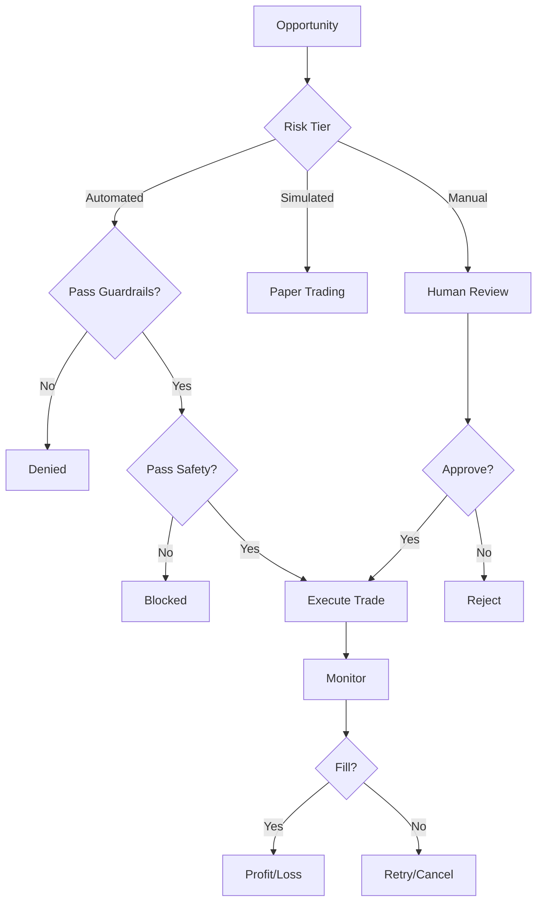

**See also:** [22_GUARDRAILS.md](22_GUARDRAILS.md), [11_RISK_ENGINE.md](11_RISK_ENGINE.md), [23_AUDIT_LOGGING.md](23_AUDIT_LOGGING.md)
# Execution Engine

**Document:** Phase 6 — Execution v1
**Cross-References:** [10_ARBITRAGE_ENGINE.md](10_ARBITRAGE_ENGINE.md), [11_RISK_ENGINE.md](11_RISK_ENGINE.md), [22_GUARDRAILS.md](22_GUARDRAILS.md)

---

## 1. Overview

3-tier execution engine for arbitrage opportunities. Supports manual review, sandboxed simulation, and automated execution with comprehensive safety controls.

**Key Properties:**
- 3 tiers — Manual, simulated, automated
- Safety-first — 6 guardrails prevent catastrophic losses
- Circuit breakers — Automatic halt on anomaly detection
- Retry logic — Exponential backoff with jitter
- Audit trail — Every action logged immutably

---

## 2. Architecture



---

## 3. Execution Tiers

### 3.1 Manual Execution

```typescript
// packages/execution/src/manual.ts
export class ManualExecutor implements Executor {
  async execute(opportunity: ArbitrageOpportunity, user: User, dto: ExecuteDto): Promise<ExecutionResult> {
    // 1. Validate opportunity not expired
    if (opportunity.expiresAt < new Date()) {
      return { status: 'failed', error: 'Opportunity expired' };
    }
    
    // 2. Check user permissions
    if (!this.auth.hasPermission(user, 'opportunities:execute')) {
      return { status: 'failed', error: 'Insufficient permissions' };
    }
    
    // 3. Create dry-run record
    const trade = await this.persistence.createTrade({
      userId: user.id,
      opportunityId: opportunity.id,
      status: 'dry_run',
      type: 'manual',
      notionalUsd: dto.notionalUsd,
      feesUsd: this.calculateFees(opportunity, dto.notionalUsd)
    });
    
    // 4. Return for review (user must confirm via UI)
    return {
      status: 'dry_run',
      tradeId: trade.id,
      message: 'Review and confirm trade'
    };
  }
}
```

### 3.2 Simulated Execution

```typescript
// packages/execution/src/simulated.ts
export class SimulatedExecutor implements Executor {
  async execute(opportunity: ArbitrageOpportunity, user: User, dto: ExecuteDto): Promise<ExecutionResult> {
    // 1. Simulate market conditions
    const buyFillPrice = this.simulateFill(opportunity.buyPrice, opportunity.buySnapshot);
    const sellFillPrice = this.simulateFill(opportunity.sellPrice, opportunity.sellSnapshot);
    
    // 2. Calculate P&L
    const buyCost = dto.notionalUsd + (dto.notionalUsd * opportunity.buySnapshot.exchange.takerFee);
    const sellRevenue = dto.notionalUsd * (sellFillPrice / buyFillPrice);
    const sellFee = sellRevenue * opportunity.sellSnapshot.exchange.takerFee;
    const netProfit = sellRevenue - buyCost - sellFee;
    
    // 3. Record trade
    const trade = await this.persistence.createTrade({
      userId: user.id,
      opportunityId: opportunity.id,
      status: 'filled',
      type: 'simulated',
      notionalUsd: dto.notionalUsd,
      feesUsd: (buyCost - dto.notionalUsd) + sellFee,
      netProfitUsd: netProfit
    });
    
    return {
      status: 'filled',
      tradeId: trade.id,
      netProfitUsd: netProfit
    };
  }
  
  private simulateFill(price: number, snapshot: PriceSnapshot): number {
    // Add random slippage (0-10 bps)
    const slippage = (Math.random() - 0.5) * 0.002;
    return price * (1 + slippage);
  }
}
```

### 3.3 Automated Execution

```typescript
// packages/execution/src/automated.ts
export class AutomatedExecutor implements Executor {
  constructor(
    private safetyChecker: SafetyChecker,
    private connectorRegistry: ConnectorRegistry,
    private persistence: SupabasePersistence
  ) {}
  
  async execute(opportunity: ArbitrageOpportunity, user: User, dto: ExecuteDto): Promise<ExecutionResult> {
    // 1. Run safety checks
    const safetyResult = this.safetyChecker.check(opportunity, user);
    if (!safetyResult.passed) {
      return {
        status: 'denied_safety',
        error: `Safety check failed: ${safetyResult.reason}`
      };
    }
    
    // 2. Get connectors
    const buyConnector = this.connectorRegistry.get(opportunity.sourceExchange);
    const sellConnector = this.connectorRegistry.get(opportunity.targetExchange);
    
    if (!buyConnector || !sellConnector) {
      return { status: 'failed', error: 'Connector not available' };
    }
    
    // 3. Execute buy order
    const buyResult = await this.executeBuy(buyConnector, opportunity, dto.notionalUsd);
    if (buyResult.status !== 'filled') {
      return buyResult;
    }
    
    // 4. Execute sell order
    const sellResult = await this.executeSell(sellConnector, opportunity, dto.notionalUsd);
    
    // 5. Record trade
    const trade = await this.persistence.createTrade({
      userId: user.id,
      opportunityId: opportunity.id,
      status: sellResult.status,
      type: 'automated',
      notionalUsd: dto.notionalUsd,
      feesUsd: buyResult.fees + sellResult.fees,
      netProfitUsd: sellResult.netProfit,
      txHash: sellResult.txHash
    });
    
    return {
      status: sellResult.status,
      tradeId: trade.id,
      netProfitUsd: sellResult.netProfit
    };
  }
  
  private async executeBuy(connector: Connector, opportunity: ArbitrageOpportunity, notionalUsd: number): Promise<OrderResult> {
    // Implementation for CEX buy
    const quantity = notionalUsd / opportunity.buyPrice;
    
    try {
      const order = await connector.createOrder({
        symbol: opportunity.pair,
        side: 'buy',
        type: 'market',
        quantity,
        price: opportunity.buyPrice
      });
      
      return {
        status: 'filled',
        fillPrice: order.price,
        fees: order.fee,
        txHash: order.id
      };
    } catch (error) {
      return {
        status: 'failed',
        error: error.message
      };
    }
  }
  
  private async executeSell(connector: Connector, opportunity: ArbitrageOpportunity, notionalUsd: number): Promise<OrderResult> {
    // Implementation for CEX sell
    const quantity = notionalUsd / opportunity.sellPrice;
    
    try {
      const order = await connector.createOrder({
        symbol: opportunity.pair,
        side: 'sell',
        type: 'market',
        quantity,
        price: opportunity.sellPrice
      });
      
      return {
        status: 'filled',
        fillPrice: order.price,
        fees: order.fee,
        netProfit: this.calculateProfit(opportunity, order.price),
        txHash: order.id
      };
    } catch (error) {
      return {
        status: 'failed',
        error: error.message
      };
    }
  }
}
```

---

## 4. Safety Guardrails

### 4.1 Safety Checker

```typescript
// packages/execution/src/safety.ts
export class SafetyChecker {
  check(opportunity: ArbitrageOpportunity, user: User): SafetyResult {
    const failures: string[] = [];
    
    // 1. Notional limit
    const maxNotional = this.getMaxNotional(user);
    if (opportunity.liquidityUsd < maxNotional) {
      failures.push(`Insufficient liquidity: ${opportunity.liquidityUsd} < ${maxNotional}`);
    }
    
    // 2. Risk score
    if (opportunity.riskScore < user.minRiskScore) {
      failures.push(`Risk too high: ${opportunity.riskScore} < ${user.minRiskScore}`);
    }
    
    // 3. Daily loss cap
    const dailyLoss = this.getDailyLoss(user.id);
    if (dailyLoss >= user.dailyLossCap) {
      failures.push(`Daily loss cap reached: ${dailyLoss} >= ${user.dailyLossCap}`);
    }
    
    // 4. Pair cap
    const pairCount = this.getTradesForPair(user.id, opportunity.pair);
    if (pairCount >= user.maxTradesPerPair) {
      failures.push(`Pair limit reached: ${pairCount} >= ${user.maxTradesPerPair}`);
    }
    
    // 5. Cooldown
    const lastTrade = this.getLastTrade(user.id);
    if (lastTrade && (Date.now() - lastTrade.timestamp) < user.cooldownMs) {
      failures.push(`Cooldown active: ${(Date.now() - lastTrade.timestamp) / 1000}s < ${user.cooldownMs / 1000}s`);
    }
    
    // 6. Auto-pause
    if (user.autoPausedUntil && user.autoPausedUntil > new Date()) {
      failures.push(`Auto-paused until ${user.autoPausedUntil}`);
    }
    
    return {
      passed: failures.length === 0,
      failures
    };
  }
  
  private getMaxNotional(user: User): number {
    return Math.min(
      user.maxAutoNotionalUsd,
      opportunity.liquidityUsd * 0.1 // Max 10% of liquidity
    );
  }
}
```

### 4.2 Guardrail Configuration

```typescript
export interface GuardrailConfig {
  readonly maxNotionalUsd: number;
  readonly minRiskScore: number;
  readonly dailyLossCapUsd: number;
  readonly maxTradesPerHour: number;
  readonly maxTradesPerDay: number;
  readonly maxTradesPerPair: number;
  readonly cooldownMs: number;
  readonly autoPausedUntil?: Date;
  readonly allowedPairs?: string[];
  readonly blockedPairs?: string[];
  readonly allowedExchanges?: string[];
  readonly blockedExchanges?: string[];
}
```

---

## 5. Circuit Breakers

### 5.1 Circuit Breaker Implementation

```typescript
export class ExecutionCircuitBreaker {
  private failures: Map<string, number> = new Map();
  private readonly THRESHOLD = 3;
  private readonly RESET_MS = 300000; // 5 minutes
  
  async execute<T>(key: string, fn: () => Promise<T>): Promise<T | null> {
    const failures = this.failures.get(key) ?? 0;
    
    if (failures >= this.THRESHOLD) {
      logger.warn({ key }, 'Circuit breaker open');
      throw new Error('Circuit breaker open');
    }
    
    try {
      const result = await fn();
      this.failures.set(key, 0);
      return result;
    } catch (error) {
      const newFailures = failures + 1;
      this.failures.set(key, newFailures);
      
      if (newFailures >= this.THRESHOLD) {
        logger.error({ key, error }, 'Circuit breaker tripped');
        // Alert via Sentry
      }
      
      throw error;
    }
  }
  
  reset(key: string): void {
    this.failures.set(key, 0);
  }
}
```

### 5.2 Circuit Breaker Triggers

| Condition | Action |
|---|---|
| 3 consecutive failures | Open circuit for 5 minutes |
| 10 failures in 1 hour | Alert ops team |
| Negative P&L > $100 | Pause auto-trading |
| Slippage > 50 bps | Block opportunity |

---

## 6. Retry Logic

### 6.1 Exponential Backoff

```typescript
export class RetryExecutor {
  async executeWithRetry<T>(
    fn: () => Promise<T>,
    maxRetries: number = 3,
    baseDelay: number = 1000
  ): Promise<T> {
    for (let attempt = 0; attempt < maxRetries; attempt++) {
      try {
        return await fn();
      } catch (error) {
        if (attempt === maxRetries - 1) throw error;
        
        const delay = baseDelay * Math.pow(2, attempt) + Math.random() * 100;
        await new Promise(resolve => setTimeout(resolve, delay));
      }
    }
    
    throw new Error('Max retries exceeded');
  }
}
```

---

## 7. Audit Logging

### 7.1 Trade Events

```typescript
export enum TradeEventType {
  TRADE_CREATED = 'trade.created',
  TRADE_EXECUTED = 'trade.executed',
  TRADE_FILLED = 'trade.filled',
  TRADE_FAILED = 'trade.failed',
  TRADE_CANCELLED = 'trade.cancelled',
  SAFETY_BLOCKED = 'safety.blocked'
}

export interface TradeEvent {
  readonly type: TradeEventType;
  readonly tradeId: string;
  readonly userId: string;
  readonly opportunityId: string;
  readonly metadata: {
    readonly notionalUsd: number;
    readonly feesUsd: number;
    readonly netProfitUsd?: number;
    readonly error?: string;
  };
}
```

---

## 8. Kill Switch

### 8.1 Global Pause

```typescript
export class KillSwitch {
  private paused = false;
  
  async pause(userId: string, reason: string): Promise<void> {
    this.paused = true;
    
    await this.persistence.updateProfile(userId, {
      autoPausedUntil: new Date(Date.now() + 24 * 60 * 60 * 1000) // 24h
    });
    
    await this.auditLogger.log({
      type: AuditEventType.KILL_SWITCH_ACTIVATED,
      userId,
      metadata: { reason }
    });
  }
  
  async resume(userId: string): Promise<void> {
    this.paused = false;
    
    await this.persistence.updateProfile(userId, {
      autoPausedUntil: null
    });
    
    await this.auditLogger.log({
      type: AuditEventType.KILL_SWITCH_DEACTIVATED,
      userId
    });
  }
  
  isPaused(): boolean {
    return this.paused;
  }
}
```

---

## 9. Testing

### 9.1 Unit Tests

```typescript
describe('ManualExecutor', () => {
  it('creates dry-run trade', async () => {
    const executor = new ManualExecutor();
    const result = await executor.execute(opportunity, user, { notionalUsd: 1000 });
    
    expect(result.status).toBe('dry_run');
    expect(result.tradeId).toBeDefined();
  });
});

describe('SafetyChecker', () => {
  it('blocks high-risk trade', () => {
    const checker = new SafetyChecker();
    const result = checker.check(highRiskOpportunity, user);
    
    expect(result.passed).toBe(false);
    expect(result.failures.length).toBeGreaterThan(0);
  });
});
```

---

## 10. Acceptance Criteria

- [ ] Manual execution creates dry-run
- [ ] Simulated execution fills trade
- [ ] Automated execution passes guardrails
- [ ] Circuit breaker opens on failures
- [ ] Retry logic with backoff
- [ ] Kill switch functional
- [ ] Audit log immutable
- [ ] Tests pass (80% coverage)

## Engineering Notes

- Never execute without safety check
- Circuit breaker prevents cascade failures
- Kill switch is manual + automatic
- All trades logged before execution
- Retry only for transient errors