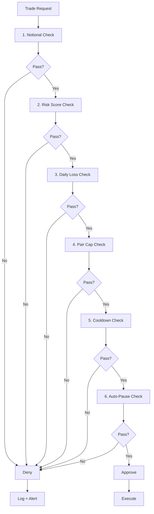

# Guardrails

**Document:** Phase 6 — Execution v1
**Cross-References:** [21_EXECUTION_ENGINE.md](21_EXECUTION_ENGINE.md), [11_RISK_ENGINE.md](11_RISK_ENGINE.md), [13_SECURITY_ARCHITECTURE.md](13_SECURITY_ARCHITECTURE.md)

---

## 1. Overview

Guardrails protect users from catastrophic losses during automated trading. Six independent checks form a defense-in-depth system that blocks dangerous trades before execution.

**Key Properties:**
- 6 independent guardrails — No single point of failure
- User-configurable — Adjustable per risk profile
- Real-time — Evaluated on every trade
- Immutable — Guardrail events logged to audit trail
- Emergency stop — Kill switch halts all activity

---

## 2. Guardrail Architecture



---

## 3. Six Guardrails

### 3.1 Notional Limit

**Purpose:** Prevents oversized trades that can't be filled.

```typescript
export function checkNotionalLimit(
  opportunity: ArbitrageOpportunity,
  user: User
): GuardrailResult {
  const maxNotional = Math.min(
    user.maxAutoNotionalUsd,
    opportunity.liquidityUsd * 0.1 // Max 10% of liquidity
  );
  
  const requestedNotional = opportunity.requestedNotionalUsd;
  
  if (requestedNotional > maxNotional) {
    return {
      passed: false,
      reason: `Notional exceeds limit: ${requestedNotional} > ${maxNotional}`,
      severity: 'high'
    };
  }
  
  return { passed: true };
}
```

**Defaults:**

| User Tier | Max Notional | Max % of Liquidity |
|---|---|---|
| Free | $100 | 10% |
| Premium | $1,000 | 10% |
| Admin | $10,000 | 10% |

### 3.2 Risk Score

**Purpose:** Blocks high-risk opportunities.

```typescript
export function checkRiskScore(
  opportunity: ArbitrageOpportunity,
  user: User
): GuardrailResult {
  const minRiskScore = user.minRiskScore; // 0-100, higher = more conservative
  
  if (opportunity.riskScore < minRiskScore) {
    return {
      passed: false,
      reason: `Risk score too low: ${opportunity.riskScore} < ${minRiskScore}`,
      severity: 'high'
    };
  }
  
  return { passed: true };
}
```

**Defaults:**

| Risk Level | Score Range | Action |
|---|---|---|
| Low | 80-100 | Execute |
| Medium | 60-79 | Execute with caution |
| High | 40-59 | Block |
| Extreme | 0-39 | Block |

### 3.3 Daily Loss Cap

**Purpose:** Limits downside per day.

```typescript
export function checkDailyLoss(
  userId: string,
  user: User
): GuardrailResult {
  const dailyLoss = getDailyLoss(userId); // From trades table
  
  if (dailyLoss >= user.dailyLossCapUsd) {
    return {
      passed: false,
      reason: `Daily loss cap reached: ${dailyLoss} >= ${user.dailyLossCapUsd}`,
      severity: 'critical'
    };
  }
  
  return { passed: true };
}
```

**Defaults:**

| User Tier | Daily Loss Cap |
|---|---|
| Free | $50 |
| Premium | $500 |
| Admin | $5,000 |

### 3.4 Pair Cap

**Purpose:** Prevents overtrading single pair.

```typescript
export function checkPairCap(
  userId: string,
  opportunity: ArbitrageOpportunity,
  user: User
): GuardrailResult {
  const pairTradesToday = countTradesForPair(userId, opportunity.pair, today());
  
  if (pairTradesToday >= user.maxTradesPerPair) {
    return {
      passed: false,
      reason: `Pair limit reached: ${pairTradesToday} >= ${user.maxTradesPerPair}`,
      severity: 'medium'
    };
  }
  
  return { passed: true };
}
```

**Defaults:**

| User Tier | Max Trades Per Pair |
|---|---|
| Free | 5 |
| Premium | 20 |
| Admin | 100 |

### 3.5 Cooldown

**Purpose:** Prevents rapid-fire trading.

```typescript
export function checkCooldown(
  userId: string,
  user: User
): GuardrailResult {
  const lastTrade = getLastTrade(userId);
  
  if (lastTrade) {
    const timeSinceLastTrade = Date.now() - lastTrade.timestamp;
    const cooldownMs = user.cooldownMs;
    
    if (timeSinceLastTrade < cooldownMs) {
      return {
        passed: false,
        reason: `Cooldown active: ${timeSinceLastTrade / 1000}s < ${cooldownMs / 1000}s`,
        severity: 'low'
      };
    }
  }
  
  return { passed: true };
}
```

**Defaults:**

| User Tier | Cooldown |
|---|---|
| Free | 300s (5min) |
| Premium | 60s (1min) |
| Admin | 10s |

### 3.6 Auto-Pause

**Purpose:** Emergency stop mechanism.

```typescript
export function checkAutoPause(user: User): GuardrailResult {
  if (user.autoPausedUntil && user.autoPausedUntil > new Date()) {
    return {
      passed: false,
      reason: `Auto-paused until ${user.autoPausedUntil}`,
      severity: 'critical'
    };
  }
  
  return { passed: true };
}
```

**Triggers:**

| Trigger | Duration |
|---|---|
| User-initiated | 24h |
| Daily loss cap hit | 24h |
| Circuit breaker tripped | 5min |
| Suspicious activity detected | Permanent until review |

---

## 4. Guardrail Evaluation

### 4.1 Evaluation Order

```typescript
export class GuardrailEvaluator {
  evaluate(opportunity: ArbitrageOpportunity, user: User): GuardrailResult {
    const checks = [
      () => checkNotionalLimit(opportunity, user),
      () => checkRiskScore(opportunity, user),
      () => checkDailyLoss(user.id, user),
      () => checkPairCap(user.id, opportunity, user),
      () => checkCooldown(user.id, user),
      () => checkAutoPause(user)
    ];
    
    for (const check of checks) {
      const result = check();
      
      if (!result.passed) {
        // Log failure
        this.auditLogger.log({
          type: AuditEventType.GUARDRAIL_BLOCKED,
          userId: user.id,
          metadata: {
            guardrail: result.reason,
            opportunityId: opportunity.id
          }
        });
        
        return result;
      }
    }
    
    return { passed: true };
  }
}
```

### 4.2 Result Codes

| Code | Meaning |
|---|---|
| `PASS` | All guardrails passed |
| `NOTIONAL_LIMIT` | Trade size too large |
| `RISK_SCORE` | Risk too high |
| `DAILY_LOSS` | Daily loss cap hit |
| `PAIR_CAP` | Too many trades on pair |
| `COOLDOWN` | Cooldown active |
| `AUTO_PAUSE` | User auto-paused |

---

## 5. User Configuration

### 5.1 Guardrail Settings

```typescript
export interface GuardrailSettings {
  readonly maxNotionalUsd: number;
  readonly minRiskScore: number;
  readonly dailyLossCapUsd: number;
  readonly maxTradesPerPair: number;
  readonly cooldownMs: number;
  readonly allowedPairs?: string[];
  readonly blockedPairs?: string[];
  readonly allowedExchanges?: string[];
  readonly blockedExchanges?: string[];
}
```

### 5.2 UI Controls

```tsx
// apps/web/components/settings/GuardrailsSettings.tsx
export function GuardrailsSettings() {
  const [settings, setSettings] = useState<GuardrailSettings>(DEFAULT_SETTINGS);
  
  return (
    <Card>
      <CardHeader>
        <CardTitle>Execution Guardrails</CardTitle>
      </CardHeader>
      <CardBody>
        <Input
          label="Max Notional (USD)"
          type="number"
          value={settings.maxNotionalUsd}
          onChange={e => setSettings({ ...settings, maxNotionalUsd: Number(e.target.value) })}
        />
        
        <Input
          label="Min Risk Score"
          type="number"
          min={0}
          max={100}
          value={settings.minRiskScore}
          onChange={e => setSettings({ ...settings, minRiskScore: Number(e.target.value) })}
        />
        
        <Input
          label="Daily Loss Cap (USD)"
          type="number"
          value={settings.dailyLossCapUsd}
          onChange={e => setSettings({ ...settings, dailyLossCapUsd: Number(e.target.value) })}
        />
        
        <Input
          label="Cooldown (seconds)"
          type="number"
          value={settings.cooldownMs / 1000}
          onChange={e => setSettings({ ...settings, cooldownMs: Number(e.target.value) * 1000 })}
        />
        
        <Button onClick={saveSettings}>Save</Button>
      </CardBody>
    </Card>
  );
}
```

---

## 6. Kill Switch

### 6.1 Global Kill Switch

```typescript
export class GlobalKillSwitch {
  private globalPause = false;
  
  async activate(reason: string): Promise<void> {
    this.globalPause = true;
    
    // Pause all users
    await this.persistence.updateAllProfiles({
      autoPausedUntil: new Date(Date.now() + 24 * 60 * 60 * 1000)
    });
    
    // Cancel all pending trades
    await this.persistence.cancelAllPendingTrades();
    
    // Alert ops team
    await this.alertOps(reason);
    
    // Log
    await this.auditLogger.log({
      type: AuditEventType.GLOBAL_KILL_SWITCH_ACTIVATED,
      metadata: { reason }
    });
  }
  
  async deactivate(): Promise<void> {
    this.globalPause = false;
    
    await this.persistence.updateAllProfiles({
      autoPausedUntil: null
    });
    
    await this.auditLogger.log({
      type: AuditEventType.GLOBAL_KILL_SWITCH_DEACTIVATED
    });
  }
  
  isActive(): boolean {
    return this.globalPause;
  }
}
```

### 6.2 Kill Switch Triggers

| Trigger | Action |
|---|---|
| API error rate >50% | Pause 5min |
| Negative P&L >$1000 in 1h | Pause 24h |
| Exchange maintenance detected | Pause 1h |
| Manual admin action | Pause 24h |

---

## 7. Monitoring

### 7.1 Metrics

```typescript
export const GUARDRAIL_METRICS = {
  blocked: new promClient.Counter({
    name: 'guardrails_blocked_total',
    help: 'Total trades blocked by guardrails',
    labelNames: ['guardrail', 'severity']
  }),
  passed: new promClient.Counter({
    name: 'guardrails_passed_total',
    help: 'Total trades passed guardrails'
  })
};
```

### 7.2 Dashboard

```json
{
  "guardrails": {
    "blocked24h": 150,
    "passed24h": 450,
    "blockRate": 0.25,
    "topBlockReason": "RISK_SCORE",
    "avgRiskScore": 65.5
  }
}
```

---

## 8. Testing

### 8.1 Unit Tests

```typescript
describe('GuardrailEvaluator', () => {
  it('blocks high risk', () => {
    const evaluator = new GuardrailEvaluator();
    const result = evaluator.evaluate(highRiskOpp, user);
    
    expect(result.passed).toBe(false);
    expect(result.reason).toContain('Risk score');
  });
  
  it('blocks daily loss cap', () => {
    const evaluator = new GuardrailEvaluator();
    const result = evaluator.evaluate(opportunity, userWithLoss);
    
    expect(result.passed).toBe(false);
    expect(result.reason).toContain('Daily loss');
  });
});
```

---

## 9. Acceptance Criteria

- [ ] All 6 guardrails implemented
- [ ] Notional limit enforced
- [ ] Risk score enforced
- [ ] Daily loss cap enforced
- [ ] Pair cap enforced
- [ ] Cooldown enforced
- [ ] Auto-pause functional
- [ ] Kill switch works
- [ ] All failures logged
- [ ] Tests pass (80% coverage)

## Engineering Notes

- Guardrails are non-bypassable
- User settings validated server-side
- All guardrail events audited
- Kill switch is last resort
- Monitor guardrail block rate