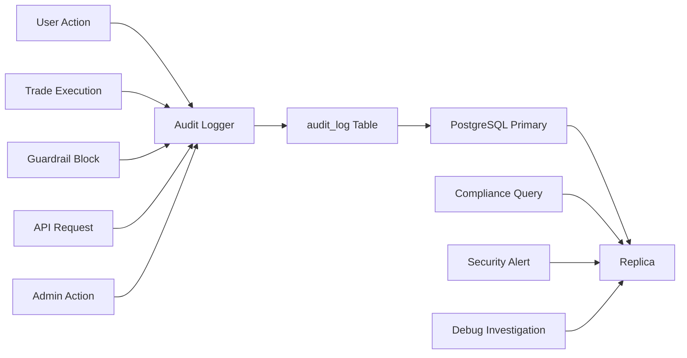

# Audit Logging

**Document:** Phase 6 — Execution v1
**Cross-References:** [21_EXECUTION_ENGINE.md](21_EXECUTION_ENGINE.md), [13_SECURITY_ARCHITECTURE.md](13_SECURITY_ARCHITECTURE.md), [22_GUARDRAILS.md](22_GUARDRAILS.md)

---

## 1. Overview

Immutable audit trail for ARBITRAGE-PRO. Records every sensitive action for compliance, debugging, and security monitoring.

**Key Properties:**
- Immutable — No UPDATE/DELETE allowed
- Append-only — INSERT only via service role
- Structured JSONB — Flexible metadata per event
- Indexed — Fast queries for compliance reports
- Retained — 90 days hot, archived thereafter

---

## 2. Architecture



---

## 3. Logger Implementation

### 3.1 Audit Logger

```typescript
// packages/audit/src/logger.ts
export class AuditLogger {
  constructor(private persistence: Persistence) {}
  
  async log(event: AuditEventInput): Promise<void> {
    const record: AuditEvent = {
      id: generateId(),
      userId: event.userId,
      eventType: event.type,
      timestamp: new Date(),
      ip: event.ip,
      userAgent: event.userAgent,
      metadata: event.metadata
    };
    
    // Insert only — never update/delete
    await this.persistence.insertAuditLog(record);
    
    // Also log to structured logger (for real-time monitoring)
    logger.info({
      auditId: record.id,
      type: record.eventType,
      userId: record.userId
    }, 'Audit event');
  }
  
  async logBatch(events: AuditEventInput[]): Promise<void> {
    const records = events.map(e => ({
      id: generateId(),
      userId: e.userId,
      eventType: e.type,
      timestamp: new Date(),
      ip: e.ip,
      userAgent: e.userAgent,
      metadata: e.metadata
    }));
    
    await this.persistence.insertAuditLogBatch(records);
  }
}
```

### 3.2 Audit Event Types

```typescript
export enum AuditEventType {
  // Authentication
  AUTH_LOGIN = 'auth.login',
  AUTH_LOGOUT = 'auth.logout',
  AUTH_MFA_SUCCESS = 'auth.mfa.success',
  AUTH_MFA_FAILED = 'auth.mfa.failed',
  
  // Opportunities
  OPPORTUNITY_VIEWED = 'opportunity.viewed',
  OPPORTUNITY_CREATED = 'opportunity.created',
  OPPORTUNITY_EXECUTED = 'opportunity.executed',
  
  // Trades
  TRADE_CREATED = 'trade.created',
  TRADE_EXECUTED = 'trade.executed',
  TRADE_FILLED = 'trade.filled',
  TRADE_FAILED = 'trade.failed',
  TRADE_CANCELLED = 'trade.cancelled',
  
  // Guardrails
  GUARDRAIL_BLOCKED = 'guardrail.blocked',
  KILL_SWITCH_ACTIVATED = 'kill_switch.activated',
  
  // Alerts
  ALERT_CREATED = 'alert.created',
  ALERT_UPDATED = 'alert.updated',
  ALERT_DELETED = 'alert.deleted',
  ALERT_FIRED = 'alert.fired',
  
  // Connectors
  CONNECTOR_ENABLED = 'connector.enabled',
  CONNECTOR_DISABLED = 'connector.disabled',
  
  // Biometrics
  BIOMETRIC_AUTH_SUCCESS = 'biometric.auth.success',
  BIOMETRIC_AUTH_FAILED = 'biometric.auth.failed',
  
  // Admin
  ADMIN_ACTION = 'admin.action',
  USER_SUSPENDED = 'user.suspended',
  USER_RESUMED = 'user.resumed'
}
```

### 3.3 Event Structure

```typescript
export interface AuditEventInput {
  readonly userId?: string;           // Null for unauthenticated
  readonly type: AuditEventType;
  readonly ip?: string;
  readonly userAgent?: string;
  readonly metadata: Record<string, any>;
}

export interface AuditEvent {
  readonly id: string;
  readonly userId?: string;
  readonly eventType: string;
  readonly timestamp: Date;
  readonly ip?: string;
  readonly userAgent?: string;
  readonly metadata: Record<string, any>;
}
```

---

## 4. Event Schemas

### 4.1 Trade Events

```typescript
{
  "type": "trade.executed",
  "userId": "uuid",
  "metadata": {
    "tradeId": "uuid",
    "opportunityId": "uuid",
    "pair": "BTC/USDT",
    "side": "buy",
    "notionalUsd": 1000.00,
    "expectedProfitBps": 61.4,
    "actualFillPrice": 59950.00,
    "feesUsd": 2.50,
    "netProfitUsd": 5.64,
    "riskScore": 75.5
  }
}
```

### 4.2 Guardrail Block Events

```typescript
{
  "type": "guardrail.blocked",
  "userId": "uuid",
  "metadata": {
    "guardrail": "RISK_SCORE",
    "reason": "Risk score too low: 45 < 60",
    "opportunityId": "uuid",
    "pair": "ETH/USDT",
    "opportunityRiskScore": 45,
    "userMinRiskScore": 60
  }
}
```

### 4.3 Auth Events

```typescript
{
  "type": "auth.login",
  "userId": "uuid",
  "ip": "203.0.113.1",
  "userAgent": "Mozilla/5.0...",
  "metadata": {
    "method": "email",
    "success": true,
    "mfaUsed": true
  }
}
```

### 4.4 Admin Events

```typescript
{
  "type": "admin.action",
  "userId": "admin-uuid",
  "metadata": {
    "action": "user_suspended",
    "targetUserId": "target-uuid",
    "reason": "Suspicious activity",
    "duration": "24h"
  }
}
```

---

## 5. Database Schema

### 5.1 Audit Log Table

```sql
CREATE TABLE IF NOT EXISTS audit_log (
  id UUID PRIMARY KEY DEFAULT gen_random_uuid(),
  user_id UUID REFERENCES auth.users(id) ON DELETE SET NULL,
  event_type TEXT NOT NULL,
  timestamp TIMESTAMPTZ DEFAULT now(),
  ip INET,
  user_agent TEXT,
  metadata JSONB DEFAULT '{}',
  
  -- Constraints
  CONSTRAINT valid_event_type CHECK (length(event_type) > 0),
  CONSTRAINT valid_metadata CHECK (jsonb_typeof(metadata) = 'object')
);

-- Indexes
CREATE INDEX idx_audit_user ON audit_log(user_id);
CREATE INDEX idx_audit_timestamp ON audit_log(timestamp DESC);
CREATE INDEX idx_audit_event_type ON audit_log(event_type);
CREATE INDEX idx_audit_user_timestamp ON audit_log(user_id, timestamp DESC);

-- Full-text search on metadata (optional)
CREATE INDEX idx_audit_metadata_gin ON audit_log USING gin(metadata);

-- RLS
ALTER TABLE audit_log ENABLE ROW LEVEL SECURITY;

-- Users can view own logs
CREATE POLICY "users_own_audit_log"
  ON audit_log FOR SELECT
  TO authenticated
  USING (auth.uid() = user_id);

-- Service role can insert (no update/delete)
CREATE POLICY "service_insert_only"
  ON audit_log FOR INSERT
  TO service_role
  WITH CHECK (true);

-- Prevent UPDATE/DELETE
REVOKE UPDATE, DELETE ON audit_log FROM service_role;
REVOKE UPDATE, DELETE ON audit_log FROM authenticated;
REVOKE UPDATE, DELETE ON audit_log FROM anon;
```

### 5.2 Retention Policy

```sql
-- Archive old logs (>90 days)
CREATE OR REPLACE FUNCTION archive_old_audit_logs()
RETURNS void AS $$
BEGIN
  INSERT INTO audit_log_archive
  SELECT * FROM audit_log
  WHERE timestamp < now() - interval '90 days';
  
  DELETE FROM audit_log
  WHERE timestamp < now() - interval '90 days';
END;
$$ LANGUAGE plpgsql;

-- Run daily
SELECT cron.schedule('archive-audit-log', '0 0 * * *', 'SELECT archive_old_audit_logs()');
```

---

## 6. Query Patterns

### 6.1 User Activity Report

```typescript
async function getUserActivity(userId: string, days: number = 30) {
  return supabase
    .from('audit_log')
    .select('*')
    .eq('user_id', userId)
    .gte('timestamp', new Date(Date.now() - days * 24 * 60 * 60 * 1000))
    .order('timestamp', { ascending: false });
}
```

### 6.2 Compliance Report

```typescript
async function getComplianceReport(startDate: Date, endDate: Date) {
  return supabase
    .from('audit_log')
    .select('event_type, count', { count: 'exact' })
    .gte('timestamp', startDate)
    .lte('timestamp', endDate)
    .in('event_type', [
      'trade.executed',
      'guardrail.blocked',
      'kill_switch.activated'
    ])
    .groupBy('event_type');
}
```

### 6.3 Security Alert Queries

```typescript
async function detectSuspiciousActivity(userId: string) {
  // Multiple failed login attempts
  const failedLogins = await supabase
    .from('audit_log')
    .select('*')
    .eq('user_id', userId)
    .eq('event_type', 'auth.mfa.failed')
    .gte('timestamp', new Date(Date.now() - 60 * 60 * 1000)) // Last hour
    .limit(5);
  
  // Guardrail blocks
  const guardrailBlocks = await supabase
    .from('audit_log')
    .select('*')
    .eq('user_id', userId)
    .eq('event_type', 'guardrail.blocked')
    .gte('timestamp', new Date(Date.now() - 24 * 60 * 60 * 1000))
    .limit(10);
  
  return { failedLogins, guardrailBlocks };
}
```

---

## 7. Integration Points

### 7.1 Auth Guard

```typescript
// apps/api/src/auth/auth.guard.ts
export class AuthGuard implements CanActivate {
  async canActivate(context: ExecutionContext): Promise<boolean> {
    const request = context.switchToHttp().getRequest();
    const user = request.user;
    
    // Log login
    await this.auditLogger.log({
      userId: user.id,
      type: AuditEventType.AUTH_LOGIN,
      ip: request.ip,
      userAgent: request.get('User-Agent'),
      metadata: {
        method: request.method === 'POST' ? 'jwt' : 'session',
        endpoint: request.url
      }
    });
    
    return true;
  }
}
```

### 7.2 Execution Service

```typescript
// packages/execution/src/audit.ts
export class ExecutionAuditLogger {
  async logTradeExecution(result: ExecutionResult, opportunity: ArbitrageOpportunity) {
    await this.auditLogger.log({
      userId: result.userId,
      type: AuditEventType.TRADE_EXECUTED,
      metadata: {
        tradeId: result.tradeId,
        opportunityId: opportunity.id,
        pair: opportunity.pair,
        notionalUsd: result.notionalUsd,
        status: result.status,
        error: result.error
      }
    });
  }
  
  async logGuardrailBlock(result: GuardrailResult, opportunity: ArbitrageOpportunity) {
    await this.auditLogger.log({
      userId: opportunity.userId,
      type: AuditEventType.GUARDRAIL_BLOCKED,
      metadata: {
        guardrail: result.guardrail,
        reason: result.reason,
        opportunityId: opportunity.id,
        pair: opportunity.pair
      }
    });
  }
}
```

---

## 8. Export & Compliance

### 8.1 CSV Export

```
timestamp,user_id,event_type,ip,user_agent,metadata
2026-07-01T12:00:00Z,uuid,trade.executed,203.0.113.1,"Mozilla/5.0",{"pair":"BTC/USDT"}
```

### 8.2 JSON Export

```json
[
  {
    "id": "uuid",
    "userId": "uuid",
    "eventType": "trade.executed",
    "timestamp": "2026-07-01T12:00:00Z",
    "ip": "203.0.113.1",
    "userAgent": "Mozilla/5.0",
    "metadata": { "pair": "BTC/USDT" }
  }
]
```

### 8.3 Compliance Metrics

```typescript
{
  "period": {
    "start": "2026-07-01T00:00:00Z",
    "end": "2026-07-01T23:59:59Z"
  },
  "totals": {
    "authentications": 1500,
    "trades_executed": 450,
    "trades_blocked": 150,
    "kill_switch_activations": 2
  },
  "users": {
    "active": 120,
    "new": 15,
    "suspended": 3
  }
}
```

---

## 9. Monitoring Alerts

### 9.1 Real-Time Alerts

```typescript
export class AuditAlertMonitor {
  async checkAlerts(): Promise<void> {
    // 1. Multiple failed logins
    const failedLogins = await this.countRecentFailures('auth.mfa.failed', 60);
    if (failedLogins > 10) {
      await this.alertOps('Multiple failed login attempts detected');
    }
    
    // 2. Mass guardrail blocks
    const blocks = await this.countRecentEvents('guardrail.blocked', 60);
    if (blocks > 50) {
      await this.alertOps('High guardrail block rate');
    }
    
    // 3. Kill switch activity
    const killSwitches = await this.countRecentEvents('kill_switch.activated', 60);
    if (killSwitches > 0) {
      await this.alertOps('Kill switch activated');
    }
  }
}
```

---

## 10. Retention & Privacy

### 10.1 Retention Policy

| Data Type | Retention | Reason |
|---|---|---|
| Audit logs | 90 days (hot) | Compliance (SEC, MiCA) |
| Trade records | 7 years | Tax reporting |
| User data | Until deletion request | GDPR |
| IP addresses | 90 days | Security only |

### 10.2 Data Subject Requests

```typescript
export class DataSubjectRequestHandler {
  async exportUserData(userId: string): Promise<UserDataExport> {
    return {
      profile: await this.getProfile(userId),
      opportunities: await this.getOpportunities(userId),
      trades: await this.getTrades(userId),
      auditLog: await this.getAuditLog(userId),
      alerts: await this.getAlerts(userId)
    };
  }
  
  async deleteUserData(userId: string): Promise<void> {
    // Anonymize audit log (keep for compliance)
    await this.anonymizeAuditLog(userId);
    
    // Delete user data
    await this.deleteProfile(userId);
    await this.deleteOpportunities(userId);
    await this.deleteTrades(userId);
  }
}
```

---

## 11. Testing

### 11.1 Unit Tests

```typescript
describe('AuditLogger', () => {
  it('creates audit event', async () => {
    const logger = new AuditLogger();
    await logger.log({
      type: AuditEventType.AUTH_LOGIN,
      userId: 'user-id',
      metadata: { success: true }
    });
    
    const events = await persistence.getAuditLog('user-id');
    expect(events).toHaveLength(1);
    expect(events[0].eventType).toBe('auth.login');
  });
});
```

---

## 12. Acceptance Criteria

- [ ] Immutable audit log table
- [ ] All sensitive events logged
- [ ] RLS enforced
- [ ] No UPDATE/DELUTE allowed
- [ ] Indexes on common queries
- [ ] Retention policy implemented
- [ ] Export functionality works
- [ ] Compliance reports available
- [ ] Tests pass (80% coverage)

## Engineering Notes

- Audit log is append-only
- Never log sensitive data (passwords, keys)
- IP addresses anonymized after 90 days
- Compliance reports quarterly
- Legal review required before deletion