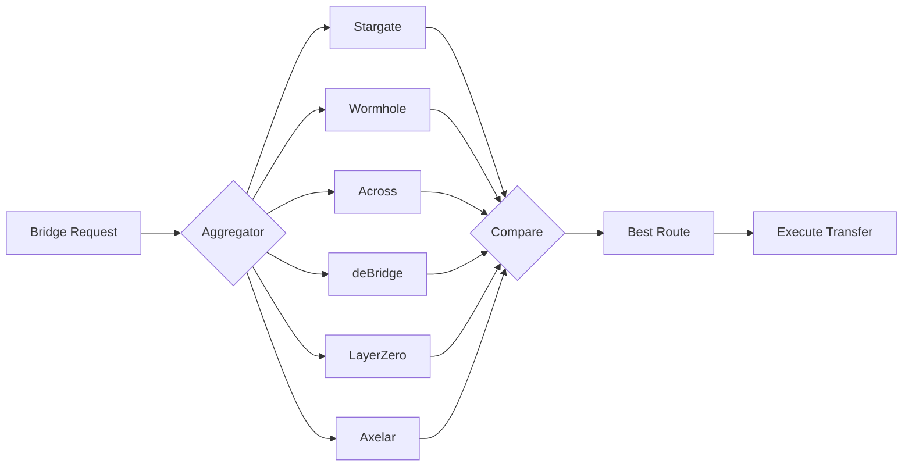

# Bridge Aggregator

**Document:** Phase 7 — DEX
**Cross-References:** [07_CONNECTOR_SPECIFICATION.md](07_CONNECTOR_SPECIFICATION.md), [26_CROSS_CHAIN_ENGINE.md](26_CROSS_CHAIN_ENGINE.md)

---

## 1. Overview

Bridge aggregator for cross-chain arbitrage. Quotes multiple bridge protocols (Stargate, Wormhole, Across, deBridge) to find cheapest/fastest routes.

**Key Properties:**
- Multi-bridge — Compare 10+ protocols
- Multi-chain — 20+ EVM chains + Solana
- Fee-aware — Includes gas + protocol fees
- Time-aware — Estimates transfer duration
- Status-aware — Handles bridge maintenance

---

## 2. Architecture



---

## 3. Bridge Connectors

### 3.1 Interface

```typescript
export interface BridgeQuote {
  readonly fromChain: string;
  readonly toChain: string;
  readonly token: string;
  readonly amount: number;
  readonly feeBps: number;
  readonly gasCostUsd: number;
  readonly estimatedTime: number;
  readonly route: string;
}

export interface BridgeConnector {
  readonly id: string;
  readonly name: string;
  readonly type: 'optimistic' | 'layer-zero' | 'guardian' | 'intent';
  
  getQuote(fromChain: string, toChain: string, token: string, amount: number): Promise<BridgeQuote | null>;
  getSupportedChains(): Promise<Chain[]>;
  getStatus(): Promise<BridgeStatus>;
}
```

### 3.2 Stargate

```typescript
export class StargateConnector implements BridgeConnector {
  readonly id = 'stargate';
  readonly name = 'Stargate';
  readonly type: BridgeConnectorType = 'layer-zero';
  
  async getQuote(params: BridgeParams): Promise<BridgeQuote | null> {
    const response = await fetch(
      `https://stargate-api.com/v2/busMessage?srcChain=${params.fromChain}&dstChain=${params.toChain}&token=${params.token}&amount=${params.amount}`
    );
    
    if (!response.ok) return null;
    
    const data = await response.json();
    
    return {
      fromChain: params.fromChain,
      toChain: params.toChain,
      token: params.token,
      amount: params.amount,
      feeBps: data.feeBps,
      gasCostUsd: this.estimateGas(params.fromChain, params.toChain),
      estimatedTime: data.estimatedTimeSeconds,
      route: 'Stargate V2'
    };
  }
}
```

### 3.3 Wormhole

```typescript
export class WormholeConnector implements BridgeConnector {
  readonly id = 'wormhole';
  readonly name = 'Wormhole';
  readonly type: BridgeConnectorType = 'guardian';
  
  async getQuote(params: BridgeParams): Promise<BridgeQuote | null> {
    const response = await fetch(
      `https://api.wormhole.com/v1/quote?srcChain=${params.fromChain}&dstChain=${params.toChain}&token=${params.token}&amount=${params.amount}`
    );
    
    const data = await response.json();
    
    return {
      fromChain: params.fromChain,
      toChain: params.toChain,
      token: params.token,
      amount: params.amount,
      feeBps: data.feeBps,
      gasCostUsd: this.estimateGas(params.fromChain, params.toChain),
      estimatedTime: 600, // ~10 minutes
      route: 'Wormhole Guardian'
    };
  }
}
```

### 3.4 Across

```typescript
export class AcrossConnector implements BridgeConnector {
  readonly id = 'across';
  readonly name = 'Across';
  readonly type: BridgeConnectorType = 'optimistic';
  
  async getQuote(params: BridgeParams): Promise<BridgeQuote | null> {
    const response = await fetch(
      `https://across-api.com/quote?srcChain=${params.fromChain}&dstChain=${params.toChain}&token=${params.token}&amount=${params.amount}`
    );
    
    const data = await response.json();
    
    return {
      fromChain: params.fromChain,
      toChain: params.toChain,
      token: params.token,
      amount: params.amount,
      feeBps: data.feeBps,
      gasCostUsd: this.estimateGas(params.fromChain, params.toChain),
      estimatedTime: 120, // ~2 minutes
      route: 'Across Optimistic'
    };
  }
}
```

### 3.5 deBridge

```typescript
export class DeBridgeConnector implements BridgeConnector {
  readonly id = 'debridge';
  readonly name = 'deBridge';
  readonly type: BridgeConnectorType = 'intent';
  
  async getQuote(params: BridgeParams): Promise<BridgeQuote | null> {
    // Intent-based order
    const response = await fetch(
      `https://api.debridge.com/v1/quote?srcChain=${params.fromChain}&dstChain=${params.toChain}&token=${params.token}&amount=${params.amount}`
    );
    
    const data = await response.json();
    
    return {
      fromChain: params.fromChain,
      toChain: params.toChain,
      token: params.token,
      amount: params.amount,
      feeBps: data.feeBps,
      gasCostUsd: this.estimateGas(params.fromChain, params.toChain),
      estimatedTime: data.estimatedTimeSeconds,
      route: 'deBridge DLN'
    };
  }
}
```

---

## 4. Bridge Aggregator

### 4.1 Aggregator Implementation

```typescript
export class BridgeAggregator {
  private connectors: BridgeConnector[];
  
  constructor() {
    this.connectors = [
      new StargateConnector(),
      new WormholeConnector(),
      new AcrossConnector(),
      new DeBridgeConnector(),
      // Add more
    ];
  }
  
  async getBestRoute(params: BridgeParams): Promise<BridgeQuote | null> {
    // 1. Fetch all quotes in parallel
    const quotes = await Promise.allSettled(
      this.connectors.map(c => c.getQuote(params))
    );
    
    // 2. Filter valid quotes
    const valid = quotes
      .filter((r): r is PromiseFulfilledResult<BridgeQuote> => 
        r.status === 'fulfilled' && r.value !== null
      )
      .map(r => r.value);
    
    if (valid.length === 0) return null;
    
    // 3. Rank by total cost (fee + gas)
    const ranked = valid.sort((a, b) => {
      const costA = (a.feeBps / 10000) * a.amount + a.gasCostUsd;
      const costB = (b.feeBps / 10000) * b.amount + b.gasCostUsd;
      return costA - costB;
    });
    
    return ranked[0];
  }
}
```

### 4.2 Bridge Registry

```typescript
// packages/connectors/src/bridge/registry.ts
export class BridgeRegistry {
  private connectors: Map<string, BridgeConnector> = new Map();
  
  register(connector: BridgeConnector): void {
    this.connectors.set(connector.id, connector);
  }
  
  get(id: string): BridgeConnector | undefined {
    return this.connectors.get(id);
  }
  
  async getEnabledConnectors(): Promise<BridgeConnector[]> {
    return Array.from(this.connectors.values()).filter(
      c => c.status === 'active'
    );
  }
}
```

---

## 5. Cross-Chain Fees

### 5.1 Gas Estimation

```typescript
export function estimateCrossChainGas(fromChain: string, toChain: string): number {
  // Source chain gas
  const sourceGas = GAS_COSTS[fromChain] ?? 0.50;
  
  // Destination chain gas (for claim tx)
  const destGas = GAS_COSTS[toChain] ?? 0.50;
  
  return sourceGas + destGas;
}

const GAS_COSTS: Record<string, number> = {
  'ethereum': 5.00,
  'bsc': 0.20,
  'arbitrum': 0.10,
  'optimism': 0.10,
  'polygon': 0.05,
  'base': 0.05,
  'solana': 0.01
};
```

### 5.2 Fee Comparison

| Bridge | Fee Type | Typical Cost (1%) | Time |
|---|---|---|---|
| Stargate V2 | LP fee + gas | 0.05-0.2% | <5min |
| Wormhole | Guardian fee + gas | 0.1-0.3% | ~10min |
| Across | Relayer fee + gas | 0.03-0.15% | ~2min |
| deBridge | Intent fee + gas | 0.02-0.1% | Variable |
| Hop | AMM swap fee | 0.1-0.5% | ~10min |

---

## 6. Supported Chains

### 6.1 EVM Chains

| Chain ID | Chain | Native Token | Status |
|---|---|---|---|
| 1 | Ethereum | ETH | Active |
| 56 | BSC | BNB | Active |
| 137 | Polygon | MATIC | Active |
| 42161 | Arbitrum | ETH | Active |
| 10 | Optimism | ETH | Active |
| 8453 | Base | ETH | Active |
| 43114 | Avalanche | AVAX | Active |

### 6.2 Non-EVM

| Chain | Native | Status |
|---|---|---|
| Solana | SOL | Active |

---

## 7. Liquidity Requirements

### 7.1 Minimum Liquidity

```typescript
export const BRIDGE_LIQUIDITY_REQUIREMENTS = {
  minBridgeAmountUsd: 100,      // $100 minimum
  maxBridgeAmountUsd: 100000,   // $100k maximum per tx
  preferredLiquidityUsd: 10000  // $10k+ for best rates
};
```

### 7.2 Slippage

```typescript
export function estimateBridgeSlippage(
  amount: number,
  liquidity: number
): number {
  // Bridge slippage model
  if (amount > liquidity) return 100; // Can't fill
  
  const ratio = amount / liquidity;
  return ratio * 20; // 20 bps per unit
}
```

---

## 8. Testing

### 8.1 Unit Tests

```typescript
describe('BridgeAggregator', () => {
  it('selects cheapest route', async () => {
    const aggregator = new BridgeAggregator();
    
    // Mock connectors
    jest.spyOn(stargate, 'getQuote').mockResolvedValue({
      ...defaultQuote,
      feeBps: 50
    });
    
    jest.spyOn(wormhole, 'getQuote').mockResolvedValue({
      ...defaultQuote,
      feeBps: 100
    });
    
    const best = await aggregator.getBestRoute(params);
    
    expect(best.route).toBe('Stargate V2');
    expect(best.feeBps).toBe(50);
  });
});
```

---

## 9. Monitoring

### 9.1 Metrics

```typescript
export const BRIDGE_METRICS = {
  quotes: new promClient.Counter({
    name: 'bridge_quotes_total',
    help: 'Total bridge quotes',
    labelNames: ['bridge', 'status']
  }),
  transfers: new promClient.Counter({
    name: 'bridge_transfers_total',
    help: 'Total bridge transfers',
    labelNames: ['bridge', 'from_chain', 'to_chain']
  }),
  volume: new promClient.Counter({
    name: 'bridge_volume_usd_total',
    help: 'Total bridge volume in USD',
    labelNames: ['bridge']
  })
};
```

---

## 10. Acceptance Criteria

- [ ] Stargate connector works
- [ ] Wormhole connector works
- [ ] Across connector works
- [ ] deBridge connector works
- [ ] Aggregator selects best route
- [ ] Gas estimation accurate
- [ ] Status checks functional
- [ ] Tests pass (70% coverage)

## Engineering Notes

- Bridges are slow — use for cross-chain only
- Always check bridge status before quoting
- Gas costs vary by network congestion
- Prefer optimistic bridges for speed
- Monitor bridge protocol upgrades