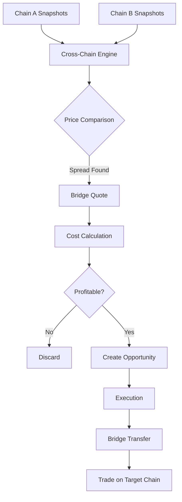

# Cross-Chain Engine

**Document:** Phase 8 — Cross-Chain Arbitrage
**Cross-References:** [10_ARBITRAGE_ENGINE.md](10_ARBITRAGE_ENGINE.md), [25_BRIDGE_AGGREGATOR.md](25_BRIDGE_AGGREGATOR.md), [26_CROSS_CHAIN_ENGINE.md](26_CROSS_CHAIN_ENGINE.md)

---

## 1. Overview

Cross-chain arbitrage engine detects price differences of the same asset across different blockchains. Bridges enable transferring funds between chains to capture the spread.

**Key Properties:**
- Multi-chain — 20+ EVM chains + Solana
- Bridge-aware — Uses bridge aggregator for cost estimates
- Slippage-aware — Accounts for bridge delays
- Capital-efficient — Reuses same capital across chains

---

## 2. Architecture



---

## 3. Detection Algorithm

### 3.1 Cross-Chain Opportunity Detection

```typescript
export class CrossChainDetector {
  constructor(
    private bridgeAggregator: BridgeAggregator,
    private riskEngine: RiskEngine
  ) {}
  
  async detect(
    snapshotsByChain: Map<string, PriceSnapshot[]>,
    baseAsset: string
  ): Promise<CrossChainOpportunity[]> {
    const opportunities: CrossChainOpportunity[] = [];
    
    // 1. Get all prices for asset across chains
    const chainPrices = this.getChainPrices(snapshotsByChain, baseAsset);
    
    // 2. Compare all chain pairs
    const chains = Array.from(chainPrices.keys());
    
    for (let i = 0; i < chains.length; i++) {
      for (let j = i + 1; j < chains.length; j++) {
        const chainA = chains[i];
        const chainB = chains[j];
        const priceA = chainPrices.get(chainA)!;
        const priceB = chainPrices.get(chainB)!;
        
        // 3. Check if spread covers bridge cost
        const spread = (priceB.bid - priceA.ask) / priceA.ask;
        const bridgeQuote = await this.bridgeAggregator.getBestRoute({
          fromChain: chainA,
          toChain: chainB,
          token: baseAsset,
          amount: 1000 // $1k test amount
        });
        
        if (!bridgeQuote) continue;
        
        const netSpread = spread - (bridgeQuote.feeBps / 10000);
        
        if (netSpread > MIN_PROFIT_BPS / 10000) {
          opportunities.push({
            type: 'cross-chain',
            asset: baseAsset,
            sourceChain: chainA,
            targetChain: chainB,
            buyPrice: priceA.ask,
            sellPrice: priceB.bid,
            grossProfitBps: spread * 10000,
            bridgeFeeBps: bridgeQuote.feeBps,
            gasCostUsd: bridgeQuote.gasCostUsd,
            netProfitBps: netSpread * 10000,
            bridgeQuote,
            detectedAt: new Date(),
            expiresAt: new Date(Date.now() + 5 * 60 * 1000) // 5min TTL
          });
        }
      }
    }
    
    return opportunities;
  }
}
```

### 3.2 Supported Assets

| Asset | Chains | Why |
|---|---|---|
| USDT | Ethereum, BSC, Polygon, Arbitrum, Optimism, Base | Stablecoin arbitrage |
| USDC | Ethereum, BSC, Polygon, Arbitrum, Optimism, Base | Stablecoin arbitrage |
| DAI | Ethereum, BSC, Polygon | Stablecoin arbitrage |
| ETH | Ethereum, Arbitrum, Optimism, Base | Native arbitrage |
| WBTC | Ethereum, BSC, Polygon | Wrapped BTC |

---

## 4. Bridge Selection

### 4.1 Selection Criteria

```typescript
export function selectBridge(quote: BridgeQuote): boolean {
  // 1. Fee must be reasonable
  if (quote.feeBps > MAX_BRIDGE_FEE_BPS) return false;
  
  // 2. Time must be acceptable
  if (quote.estimatedTime > MAX_BRIDGE_TIME_SECONDS) return false;
  
  // 3. Gas must be covered by spread
  if (quote.gasCostUsd > MIN_SPREAD_USD) return false;
  
  // 4. Route must be active
  if (quote.status !== 'active') return false;
  
  return true;
}
```

### 4.2 Bridge Comparison

| Bridge | Speed | Cost | Chains | Trust |
|---|---|---|---|---|
| Across | 2-5min | Low | L2s | Optimistic |
| Stargate | 5-10min | Medium | 20+ | LayerZero |
| Wormhole | 10-20min | Medium | 20+ | Guardians |
| deBridge | 5-15min | Low | 10+ | Intent-based |
| Hop | 5-10min | Medium | L2s | AMM |

---

## 5. Execution Flow

### 5.1 Cross-Chain Trade

```typescript
export class CrossChainExecutor {
  async execute(opportunity: CrossChainOpportunity): Promise<ExecutionResult> {
    // 1. Approve bridge contract
    await this.approveToken(opportunity.asset, opportunity.sourceChain);
    
    // 2. Execute bridge transfer
    const bridgeTx = await this.bridgeAggregator.executeBridge(
      opportunity.bridgeQuote
    );
    
    // 3. Wait for bridge completion
    await this.waitForBridgeCompletion(bridgeTx.txHash);
    
    // 4. Trade on target chain
    const tradeResult = await this.executeTradeOnChain(
      opportunity.targetChain,
      opportunity
    );
    
    // 5. Bridge back (reverse)
    const returnBridge = await this.bridgeAggregator.getBestRoute({
      fromChain: opportunity.targetChain,
      toChain: opportunity.sourceChain,
      token: opportunity.asset,
      amount: tradeResult.amount
    });
    
    // 6. Execute return bridge
    await this.bridgeAggregator.executeBridge(returnBridge);
    
    return {
      status: 'filled',
      txHash: tradeResult.txHash,
      profitUsd: tradeResult.profitUsd
    };
  }
}
```

### 5.2 Bridge Wait

```typescript
private async waitForBridgeCompletion(txHash: string): Promise<void> {
  const maxWait = 30 * 60 * 1000; // 30min max
  const start = Date.now();
  
  while (Date.now() - start < maxWait) {
    const status = await this.getBridgeStatus(txHash);
    
    if (status === 'completed') {
      return;
    }
    
    if (status === 'failed') {
      throw new Error('Bridge transfer failed');
    }
    
    await new Promise(resolve => setTimeout(resolve, 5000)); // Check every 5s
  }
  
  throw new Error('Bridge timeout');
}
```

---

## 6. Risk Factors

### 6.1 Cross-Chain Risks

| Risk | Severity | Mitigation |
|---|---|---|
| Bridge failure | High | Multiple bridge options |
| Bridge delay | Medium | Time buffer in opportunity TTL |
| Gas spike | Medium | Estimate high gas |
| Slippage | Medium | Wider spreads only |
| Reorg | Low | Wait for confirmations |

### 6.2 Risk Scoring

```typescript
export function scoreCrossChainRisk(
  opportunity: CrossChainOpportunity
): number {
  let score = 100;
  
  // Deduct for bridge time
  if (opportunity.bridgeQuote.estimatedTime > 600) {
    score -= 20;
  }
  
  // Deduct for high fees
  if (opportunity.bridgeFeeBps > 100) {
    score -= 30;
  }
  
  // Deduct for low liquidity
  if (opportunity.liquidityUsd < 5000) {
    score -= 20;
  }
  
  return Math.max(0, score);
}
```

---

## 7. Capital Efficiency

### 7.1 Capital Recycling

```typescript
export class CapitalRecycler {
  private pendingBridges: Map<string, BridgeTransaction> = new Map();
  
  async trackBridge(bridgeTx: BridgeTransaction): Promise<void> {
    this.pendingBridges.set(bridgeTx.id, bridgeTx);
    
    // When bridge completes, recycle capital
    bridgeTx.onComplete(() => {
      this.recycleCapital(bridgeTx);
    });
  }
  
  private async recycleCapital(bridgeTx: BridgeTransaction): Promise<void> {
    // Return capital to available pool
    await this.capitalManager.release(
      bridgeTx.amount,
      bridgeTx.toChain
    );
  }
}
```

### 7.2 Multi-Leg Arbitrage

```
1. Bridge USDT from Ethereum → BSC
2. Buy BTC on BSC (low price)
3. Bridge BTC from BSC → Ethereum
4. Sell BTC on Ethereum (high price)
5. Profit = (sell - buy) - bridge fees
```

---

## 8. Monitoring

### 8.1 Metrics

```typescript
export const CROSS_CHAIN_METRICS = {
  opportunities: new promClient.Counter({
    name: 'cross_chain_opportunities_total',
    help: 'Cross-chain opportunities detected',
    labelNames: ['asset', 'source_chain', 'target_chain']
  }),
  bridges: new promClient.Counter({
    name: 'cross_chain_bridges_total',
    help: 'Bridge transfers executed',
    labelNames: ['bridge', 'from_chain', 'to_chain']
  }),
  profit: new promClient.Histogram({
    name: 'cross_chain_profit_usd',
    help: 'Profit per cross-chain trade',
    buckets: [1, 5, 10, 50, 100, 500]
  })
};
```

---

## 9. Testing

### 9.1 Unit Tests

```typescript
describe('CrossChainDetector', () => {
  it('detects profitable opportunity', async () => {
    const detector = new CrossChainDetector();
    
    const snapshots = new Map([
      ['ethereum', [createSnapshot('ETH', 2000, 2010)]],
      ['arbitrum', [createSnapshot('ETH', 1990, 2000)]]
    ]);
    
    const opps = await detector.detect(snapshots, 'ETH');
    
    expect(opps.length).toBeGreaterThan(0);
    expect(opps[0].netProfitBps).toBeGreaterThan(0);
  });
});
```

---

## 10. Acceptance Criteria

- [ ] Detector finds cross-chain opportunities
- [ ] Bridge aggregator selects best route
- [ ] Bridge execution works
- [ ] Capital recycling functional
- [ ] Risk scoring accurate
- [ ] Tests pass (70% coverage)

## Engineering Notes

- Bridges are slow — 5-20 minutes
- Always bridge back to recycle capital
- Prefer optimistic bridges (Across) for speed
- Monitor bridge protocol status
- Diversify across multiple bridges