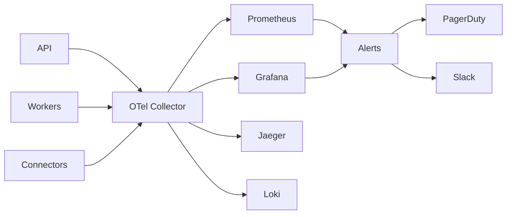

**See also:** [30_PERFORMANCE_TARGETS.md](30_PERFORMANCE_TARGETS.md), [27_TESTING_STRATEGY.md](27_TESTING_STRATEGY.md), [29_DEPLOYMENT.md](29_DEPLOYMENT.md)
# Observability

**Document:** Engineering Standards
**Cross-References:** [21_EXECUTION_ENGINE.md](21_EXECUTION_ENGINE.md), [22_GUARDRAILS.md](22_GUARDRAILS.md), [23_AUDIT_LOGGING.md](23_AUDIT_LOGGING.md)

---

## 1. Overview

Comprehensive observability stack for ARBITRAGE-PRO. Monitors system health, performance, business metrics, and security events.

**Key Properties:**
- Metrics — Prometheus + Grafana dashboards
- Logs — Structured JSON with correlation IDs
- Traces — OpenTelemetry distributed tracing
- Alerts — PagerDuty + Slack integration
- Dashboards — Real-time operational views

---

## 2. Architecture



---

## 3. Metrics

### 3.1 Instrumentation

```typescript
// packages/observability/src/metrics.ts
import * as promClient from 'prom-client';

export const METRICS = {
  // API Metrics
  httpRequests: new promClient.Counter({
    name: 'http_requests_total',
    help: 'Total HTTP requests',
    labelNames: ['method', 'path', 'status']
  }),
  
  httpDuration: new promClient.Histogram({
    name: 'http_request_duration_seconds',
    help: 'HTTP request duration',
    labelNames: ['method', 'path'],
    buckets: [0.01, 0.05, 0.1, 0.5, 1, 5]
  }),
  
  // Business Metrics
  opportunitiesDetected: new promClient.Counter({
    name: 'opportunities_detected_total',
    help: 'Total opportunities detected',
    labelNames: ['type', 'pair']
  }),
  
  tradesExecuted: new promClient.Counter({
    name: 'trades_executed_total',
    help: 'Total trades executed',
    labelNames: ['type', 'status']
  }),
  
  guardrailsBlocked: new promClient.Counter({
    name: 'guardrails_blocked_total',
    help: 'Total trades blocked by guardrails',
    labelNames: ['guardrail', 'severity']
  }),
  
  // Connector Metrics
  connectorLatency: new promClient.Histogram({
    name: 'connector_latency_seconds',
    help: 'Connector response time',
    labelNames: ['exchange', 'endpoint'],
    buckets: [0.05, 0.1, 0.5, 1, 5]
  }),
  
  connectorErrors: new promClient.Counter({
    name: 'connector_errors_total',
    help: 'Total connector errors',
    labelNames: ['exchange', 'error_type']
  }),
  
  // Queue Metrics
  queueDepth: new promClient.Gauge({
    name: 'queue_depth',
    help: 'Current queue depth',
    labelNames: ['queue_name']
  }),
  
  jobDuration: new promClient.Histogram({
    name: 'job_duration_seconds',
    help: 'Job processing duration',
    labelNames: ['job_type'],
    buckets: [0.1, 0.5, 1, 5, 10, 30]
  })
};
```

### 3.2 Middleware

```typescript
// apps/api/src/common/metrics.middleware.ts
@Injectable()
export class MetricsMiddleware implements NestMiddleware {
  use(req: Request, res: Response, next: NextFunction) {
    const start = Date.now();
    
    res.on('finish', () => {
      const duration = (Date.now() - start) / 1000;
      
      METRICS.httpRequests.inc({
        method: req.method,
        path: req.route?.path || req.path,
        status: res.statusCode
      });
      
      METRICS.httpDuration.observe({
        method: req.method,
        path: req.route?.path || req.path,
        value: duration
      });
    });
    
    next();
  }
}
```

---

## 4. Logging

### 4.1 Structured Logging

```typescript
// packages/observability/src/logger.ts
import pino from 'pino';

export const logger = pino({
  level: process.env.LOG_LEVEL || 'info',
  formatter: (log) => {
    return {
      timestamp: new Date().toISOString(),
      ...log,
      service: 'arbitrage-pro',
      environment: process.env.NODE_ENV
    };
  },
  transport: {
    target: 'pino-pretty',
    options: { colorize: true }
  }
});

// Usage
logger.info({ userId, opportunityId }, 'Opportunity detected');
logger.error({ error, userId }, 'Trade execution failed');
```

### 4.2 Log Correlation

```typescript
// Request correlation ID middleware
export class CorrelationIdMiddleware implements NestMiddleware {
  use(req: Request, res: Response, next: NextFunction) {
    const correlationId = req.headers['x-correlation-id'] || generateId();
    
    req.headers['x-correlation-id'] = correlationId;
    res.set('x-correlation-id', correlationId);
    
    // Log all requests with correlation ID
    logger.info({ correlationId, method: req.method, path: req.url }, 'Request');
    
    next();
  }
}
```

### 4.3 Log Levels

| Level | Usage | Example |
|---|---|---|
| ERROR | Failures | Trade execution failed |
| WARN | Degradation | Connector slow response |
| INFO | Business events | Opportunity detected |
| DEBUG | Development | Snapshot details |
| TRACE | Detailed | Raw API responses |

---

## 5. Distributed Tracing

### 5.1 OpenTelemetry Setup

```typescript
// apps/api/src/main.ts
import { NodeSDK } from '@opentelemetry/sdk-node';
import { OTLPTraceExporter } from '@opentelemetry/exporter-trace-otlp-http';
import { getNodeAutoInstrumentations } from '@opentelemetry/instrumentation';

const sdk = new NodeSDK({
  traceExporter: new OTLPTraceExporter({
    url: 'http://jaeger:4318/v1/traces'
  }),
  instrumentations: [
    getNodeAutoInstrumentations()
  ]
});

sdk.start();
```

### 5.2 Trace Context

```typescript
// packages/observability/src/tracer.ts
import { trace } from '@opentelemetry/api';

export class TracedExecutor {
  async execute(opportunity: Opportunity): Promise<void> {
    const span = trace.getSpan(context.active()) ?? trace.startSpan('execute');
    
    try {
      // Buy leg
      const buySpan = trace.startSpan('buy-order', undefined, span);
      await this.executeBuy(opportunity);
      buySpan.end();
      
      // Sell leg
      const sellSpan = trace.startSpan('sell-order', undefined, span);
      await this.executeSell(opportunity);
      sellSpan.end();
      
      span.setStatus({ code: SpanStatusCode.OK });
    } catch (error) {
      span.setStatus({ code: SpanStatusCode.ERROR, message: error.message });
      throw error;
    } finally {
      span.end();
    }
  }
}
```

---

## 6. Grafana Dashboards

### 6.1 System Health Dashboard

```json
{
  "dashboard": {
    "title": "ARBITRAGE-PRO - System Health",
    "panels": [
      {
        "title": "Request Rate",
        "type": "graph",
        "targets": [
          {
            "expr": "rate(http_requests_total[5m])",
            "legendFormat": "{{method}} {{path}}"
          }
        ]
      },
      {
        "title": "Response Time (p95)",
        "type": "graph",
        "targets": [
          {
            "expr": "histogram_quantile(0.95, rate(http_request_duration_seconds_bucket[5m]))"
          }
        ]
      },
      {
        "title": "Error Rate",
        "type": "graph",
        "targets": [
          {
            "expr": "rate(http_requests_total{status=~\"5..\"}[5m])"
          }
        ]
      }
    ]
  }
}
```

### 6.2 Business Metrics Dashboard

```json
{
  "dashboard": {
    "title": "ARBITRAGE-PRO - Business Metrics",
    "panels": [
      {
        "title": "Opportunities per Minute",
        "type": "graph",
        "targets": [
          {
            "expr": "rate(opportunities_detected_total[1m])"
          }
        ]
      },
      {
        "title": "Trade Success Rate",
        "type": "gauge",
        "targets": [
          {
            "expr": "sum(trades_executed_total{status=\"success\"}) / sum(trades_executed_total)"
          }
        ]
      },
      {
        "title": "Guardrail Blocks",
        "type": "graph",
        "targets": [
          {
            "expr": "rate(guardrails_blocked_total[5m])"
          }
        ]
      }
    ]
  }
}
```

---

## 7. Alerting

### 7.1 Alert Rules

```yaml
# alerts/system.yml
groups:
  - name: system
    rules:
      - alert: HighErrorRate
        expr: rate(http_requests_total{status=~"5.."}[5m]) > 0.05
        for: 5m
        labels:
          severity: critical
        annotations:
          summary: "High error rate detected"
          
      - alert: HighLatency
        expr: histogram_quantile(0.95, rate(http_request_duration_seconds_bucket[5m])) > 1
        for: 5m
        labels:
          severity: warning
        annotations:
          summary: "High API latency"
          
      - alert: ConnectorDown
        expr: connector_up == 0
        for: 1m
        labels:
          severity: critical
        annotations:
          summary: "Connector {{exchange}} is down"
```

### 7.2 Alertmanager Config

```yaml
# alertmanager.yml
route:
  receiver: 'default'
  routes:
    - match:
        severity: critical
      receiver: pagerduty
    - match:
        severity: warning
      receiver: slack

receivers:
  - name: pagerduty
    pagerduty_configs:
      - service_key: '${PAGERDUTY_KEY}'
      
  - name: slack
    slack_configs:
      - api_url: '${SLACK_WEBHOOK}'
        channel: '#alerts'
```

---

## 8. Health Checks

### 8.1 Liveness Probe

```typescript
// apps/api/src/health/liveness.controller.ts
@Controller('health/live')
export class LivenessController {
  @Get()
  async check() {
    return { status: 'ok' };
  }
}
```

### 8.2 Readiness Probe

```typescript
@Controller('health/ready')
export class ReadinessController {
  constructor(
    private db: Database,
    private redis: Redis,
    private connectors: ConnectorRegistry
  ) {}
  
  async check() {
    const checks = {
      database: await this.db.ping(),
      redis: await this.redis.ping(),
      connectors: await this.connectors.getHealth()
    };
    
    const healthy = Object.values(checks).every(c => c.status === 'ok');
    
    return {
      status: healthy ? 'ready' : 'degraded',
      checks
    };
  }
}
```

---

## 9. SLOs

### 9.1 Service Level Objectives

| SLO | Target | Measurement |
|---|---|---|
| Availability | 99.9% | Uptime per month |
| API Latency (p95) | <200ms | Request duration |
| Error Rate | <0.1% | 5xx responses |
| Opportunity Detection | <5s | Detector cycle |
| Trade Execution | <30s | End-to-end time |

### 9.2 Error Budget

```typescript
export function calculateErrorBudget(slo: number, period: string): number {
  const minutes = {
    'hour': 60,
    'day': 1440,
    'week': 10080,
    'month': 43200
  }[period];
  
  const allowedDowntime = minutes * (1 - slo);
  
  return allowedDowntime;
}

// 99.9% SLO = 43.2 minutes downtime per month
```

---

## 10. Tracing Examples

### 10.1 Full Trade Trace

```
trace_id: abc123
  - execute (root)
    - fetch-opportunity (50ms)
    - check-guardrails (10ms)
    - buy-order-binance (200ms)
    - wait-for-fill (5000ms)
    - sell-order-coinbase (150ms)
    - wait-for-fill (3000ms)
    - record-trade (20ms)
total: 8430ms
```

---

## 11. Acceptance Criteria

- [ ] Prometheus scraping configured
- [ ] Grafana dashboards deployed
- [ ] Structured logging enabled
- [ ] OpenTelemetry tracing working
- [ ] Alerts configured in PagerDuty
- [ ] Health checks passing
- [ ] SLOs defined and tracked
- [ ] Logs retained 90 days

## Engineering Notes

- All logs in JSON format
- Correlation ID on every request
- Traces sampled at 10% in production
- Dashboards version-controlled
- Alerts reviewed weekly